# 网络编程

RFC规范中定义了TCP/UDP的通信规范，像是3次握手，累积确认等，很复杂，我们于是抽象出来了socket的概念。大概是这样的：**(客户端IP, 客户端Port,  服务器端IP, 服务器端Port)**

先来看客户端：（详细看这个：https://mp.weixin.qq.com/s/XmWVy2ARauSBoehygs4Zvw）

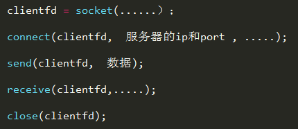

clientfd文件描述符，connect三次握手。

服务端是这样的：

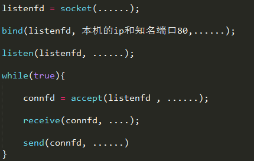

注意：**accept 相当于和客户端的connect 一起完成了TCP的三次握手**。还需要注意的是一旦accept 新的连接， 新的connfd 就会生成。新的socket是这样的，服务端是同一个端口，但是客户端的ip和port是不同的。

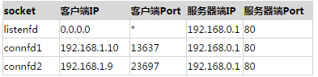

总结下socket，本质上就是封装了TCP/UDP协议的细节，使我们通过简单的几步即可实现网络编程。


# 后端编程核心

我们来看下http服务端核心技术的演化：https://mp.weixin.qq.com/s/WO2GuaUCtvUFWIupgpWcbg

我们来看下Http Server的演化，第一个阶段是借助socket来传输文件。但是存在的问题是阻塞的问题。我们引入了多进程编程：当accept连接以后，对于这个新的socket ，  不在主进程里处理， 而是新创建子进程来接管。 这样主进程就不会阻塞在receive 上， 可以继续接受新的连接了。

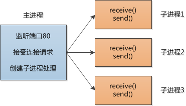

问题没有得到完美的解决，当请求数量多的时候，我们需要耗费大量的资源，即使把进程换成线程，依然解决不了这个问题。

我们需要解决这个问题，来思考这个问题：

> **一个Socket连接就是一个所谓的文件描述符（File Descriptor ,简称 fd , 是个整数） , 这个fd 背后是一个简单的数据结构， 但是我们用了一个非常重量级的东西-- 进程 --来表示对它的读写操作，  有点浪费啊**。

我们需要改变服务器的工作方式，当接受了客户端连接以后， 不能那么着急的去读，  把每个socket fd告诉内核，然后阻塞。操作系统会在后台检查这些编号的socket,  如果发现这些socket 可以读写， 会把对应的socket 做个标记， 把服务器唤醒去处理这些socket 的数据， 处理完了，再把socket fd 告诉内核， 再次进入阻塞，如此循环往复。

进程告诉操作系统要等待什么东西， 然后阻塞，  如果事件发生了， 操作系统就把进程唤醒， 让进程做事情。”

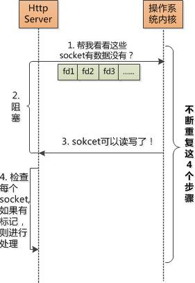

关键点是进程等操作系统的通知， 操作系统把内核从阻塞状态唤醒后， 内核一定要去遍历一遍所有的socket fd，看看谁有标记， 有标记的做相应处理。  把这种方式叫做 select。

用select的方式改写了Http server， 抛弃了一个socket请求对于一个进程的模式，  现在用一个进程就可以处理所有的socket了。

到这里似乎完美的解决了问题，但是还是存在着问题，第一个问题是一个进程最多有1024个socket fd，另一个问题是每次从阻塞中恢复以后，需要遍历这1000多个socket fd， 看看有没有标志位需要处理。

事实上， **很多socket 并不活跃**，每次可能只有几十个需要处理的socket，但是不得不查看所有的socket fd。所以引入了epoll模型。

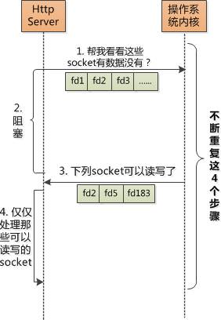

我们来看下，epoll和select 其实类似，我们不需要遍历整个集合，只需要处理变化的集合即可。

## **web服务器VS web容器**

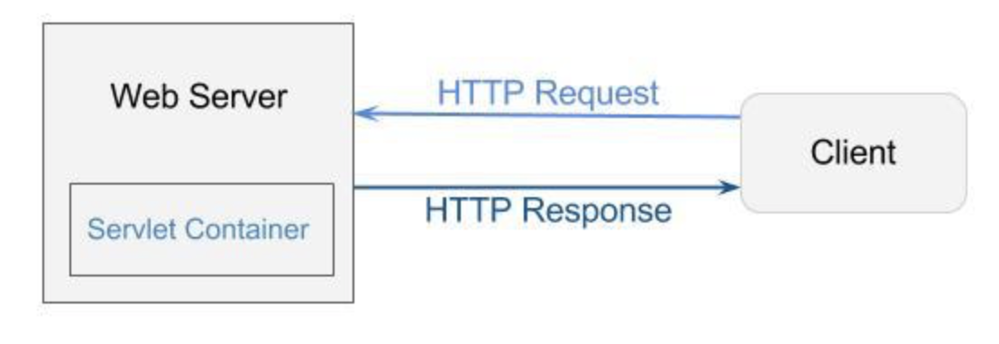

在Java方面，web容器一般是指Servlet容器。Servlet容器是与Java Servlet交互的web容器的组件。Servlet容器负责管理Servlet的生命周期、把URL映射到特定的Servlet、确保URL请求拥有正确的访问权限和更多类似的服务。综合来看，Servlet容器就是用来运行你的Servlet和维护它的生命周期的运行环境。

**apache是服务器，tomcat是Servlet容器。**

web服务器（apache）负责负载均衡，处理Http请求。tomcat容器（Servlet容器）负责管理Servlet.

## 静态服务器nginx

Web服务器是个挺简单的东西，工作很简单，在80端口上监听，解析客户端发过来的HTTP的请求， 然后把相对应的HTML文件、Image等返回给客户端就可以了。 像这样：

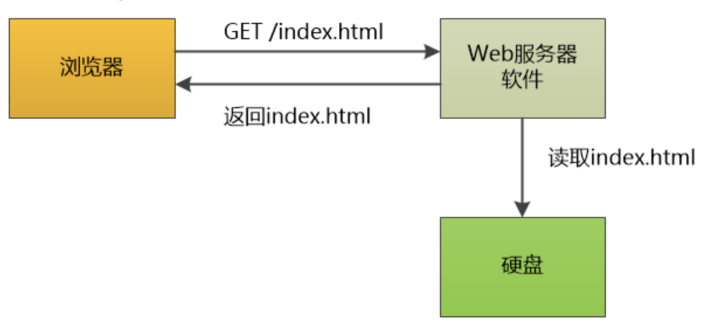

这就是一个静态内容服务器，所谓静态内容，就是服务器端的内容如HTML不会变化，每次请求都是一样的。除非人们手工改了它。实现这样一个“玩具Web服务器”并不难，只要能了解服务器端Socket编程就可以了， 主要工作是编程处理HTTP协议的细节。

这个玩意就是静态服务器的原理。

## 动态服务器tomcat

但是如果想再往前走一步，让Web服务器能产生动态内容，那就难了。

比如说来了一个HTTP请求，在其中携带者用户名和密码，要求你去数据库做一个查询，看看用户是否存在。

POST  /login

user=xxxx&pwd=xxx

这个静态的Web服务器就搞不定了，它根本，也不应该去查询数据库。

怎么办呢？你可以用某种语言（比如C语言）写个程序， 来查询数据库，假设这个程序的名字叫db-query。

可是你将面对非常棘手的问题： Web服务器是个进程，db-query也是个进程，这俩货之间怎么通信呢？

首先是参数的传递，一种办法是这样：对于每个动态请求，Web服务器进程创建一个db-query的子进程，然后通过环境变量把参数传递过去。

web服务器：

setenv("QUERY_STRING","user=xxxx&pwd=xxx")

db-query子进程 ：

param = getenv("QUERY_STRING")。

下一个问题：db-query这个子进程获得了用户名和密码，查询了数据库，怎么把查询结果返回给浏览器？

有个很巧妙的办法！

每个程序都有所谓的标准输出（STDOUT），db-query只要调用printf这个函数，数据就会输出到STDOUT，我们就可以在黑乎乎的控制台上看到了数据输出了。

但是输出到控制台是万万不行的，我们得输出到socket才可以发回浏览器。

每个浏览器和服务器的连接都是一个Socket， 每个socket都有一个文件描述符fd， 如果把查询数据库程序db-query的STDOUT重定向到那个fd，会发生什么？

没错！db-query的所有输出都直接发送的客户端的socket了，Web服务器可以撒手不管了！

当然，如果浏览器要看到的是HTML页面， 那db-query这个程序就需要输出HTML了。

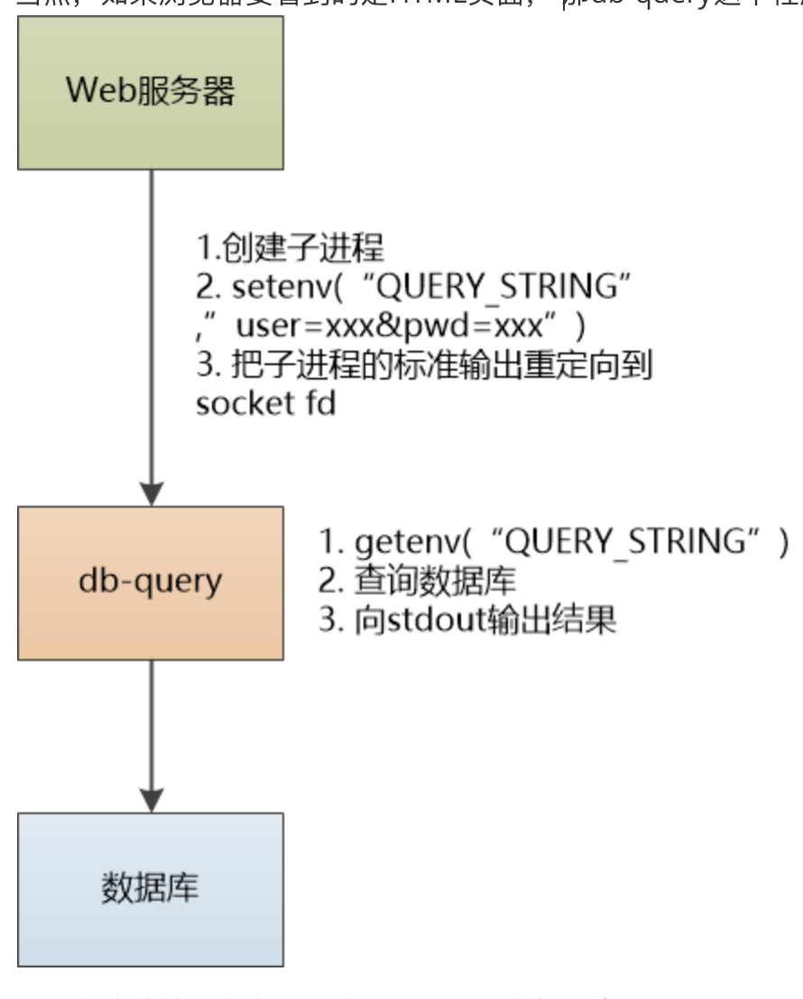

这种方式就就是大名鼎鼎的CGI通用网关接口（Common Gateway Interface），当你看到网址中有cgi-bin字样的时候，很有可能就是用CGI实现的。 只要遵循CGI协议， 可以用任何语言来实现动态的网站。

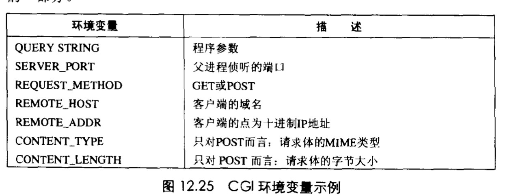

一个CGI程序将他的动态内容发送到标准输出，在子进程加载并运行CGI程序之前，他使用Unix dup2函数将标准输出到重定向到客户端相关联的已连接描述符。注意，父进程不知道子进程生成的内容的类型和大小，所以子进程负责生成Content-type和Content-length响应报头，终止报头的空行。


这是人类迈出的一大步，有了这一步，才能在网上购物，办公，社交，聊天。

但是，CGI是非常复杂和笨拙的， 主要体现在：

第一，对每个请求，都得创建一个子进程去执行，这是个非常大的开销。

第二，对程序员来说，编程极为痛苦，要操作环境变量，还需要直接在编程语言中输出HTML！

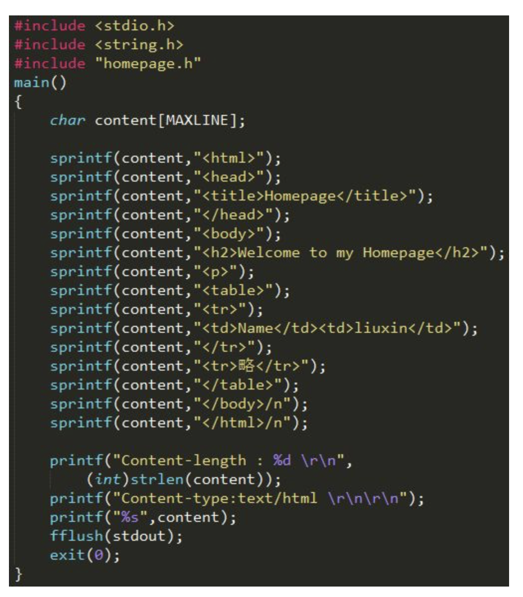

麻烦不麻烦，难受不难受，上个世纪的程序员苦逼不苦逼？

## Servlet

怎么才能跳出苦海？必须得做到关注点的分离！

程序员的关注点是：拿到Http 请求中的数据，执行业务， 然后输出Http 响应。 别的什么环境变量，重定向，别来烦我！那就简单了，让程序员写个类，里边是业务逻辑， 然后我们想办法构建一个HttpRequest对象和HttpResponse对象，传递给程序员的类让他使用不就行了？

谁来创建这个HttpRequest和HttpResponse对象，  然后调用程序员写的类？

静态Web服务器表示我不愿意，我就想管好我这一亩三分地，把静态内容给大家服务好。

Tomcat已经迫不及待地要上场了，我来我来。码农朋友们，我送给你们一个规范，叫Servlet， 你们按照Servlet的规范来写程序，放到我这里运行，别的什么都不用管了。（需要一个能够运行Servlet的容器 ， 这个容器Sun 最早实现了一个，叫Java Web Server, 1999年捐给了Apache Software foundation , 就改名叫Tomcat 。）

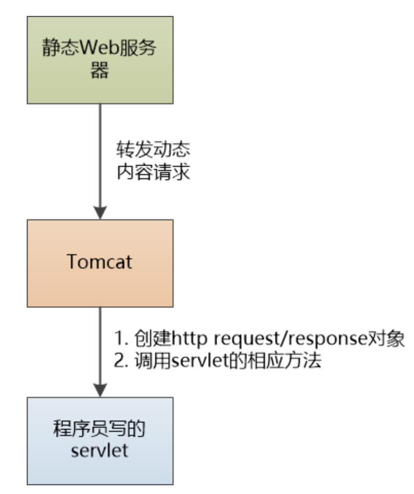

程序员很高兴，只需要写简单的Servlet就行了，HttpRequest和HttpResponse对象由Tomcat来创建，可以从HttpRequest中获得Header, Cookie, QueryString 等信息， 从HttpResponse中获得输出流，直接向浏览器输出结果， 简单又直接。

Tomcat还郑重向大家声明：对于每个请求，我只会用一个线程来出来，线程的开销可比进程小多了。

对于那个在代码中混杂HTML的问题怎么处理？

Servlet 输出html ,还是采用了老的CGI 方式，是一句一句输出，所以，编写和修改 HTML 非常不方便。于是 Java Server Pages(JSP) 就来救急了，JSP 并没有增加任何本质上不能用 Servlet 实现的功能。实际上JSP在运行之前，需要先编译成servlet , 然后才执行的。

 Tomcat也有办法， 可以在HTML混杂代码！这就是JSP（之前是Java中写html，现在是html中写Java）。执行期其实会被编译成Servlet。

你看，责任分离了，每个人只要办好自己的事情就好。

（注：实际上，我们不会在Servlet中写业务逻辑， Servlet现在通常是一个通往框架的入口。）

既然是Web 服务器， Tomcat除了能运行Servlet和JSP之外， 也能像Apache/nginx 那样，支持静态html, 图片，文档的访问， 只是性能要差一些， 在实际的应用中， 一般是这么使用他们的：

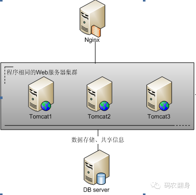

当Servlet容器启动时，它会部署并加载所有的web应用。当web应用被加载时，Servlet容器会一次性为每个应用创建Servlet上下文（ServletContext）并把它保存在内存里。Servlet容器会处理web应用的web.xml文件，并且一次性创建在web.xml里定义的Servlet、Filter和Listener，同样也会把它们保存在内存里。当Servlet容器关闭时，它会卸载所有的web应用和ServletContext，所有的Servlet、Filter和Listner实例都会被销毁。

## WSGI

CGI表示不服：遵循我的协议，任何语言都可以来实现动态网站，你Servlet只是Java规范，不管别的语言了？

Servlet规范确实没法跨语言实现，那要是Python也想做动态Web网站，该怎么办？

既然已经认识到动态网站的本质了， 可以采用类似的思想来处理嘛！ 我们为Python也定义一个规范，叫做WSGI （Web Service Gateway Interface）。

让程序员写个类或者函数（称为wsgi application），在其中实现逻辑。让某个动态服务器(称为wsgi server)把Http Request和Response传递给它，就可以执行了。

但是Python表示：我不喜欢你们Java 那一套啰里啰嗦的类，HttpRequest 不就是一些key value吗？放到我钟爱的dict中多好 ！我把它叫做enviroment， HttpResponse也没必要，直接用函数的返回值（确切说是一个可迭代对象）就好。

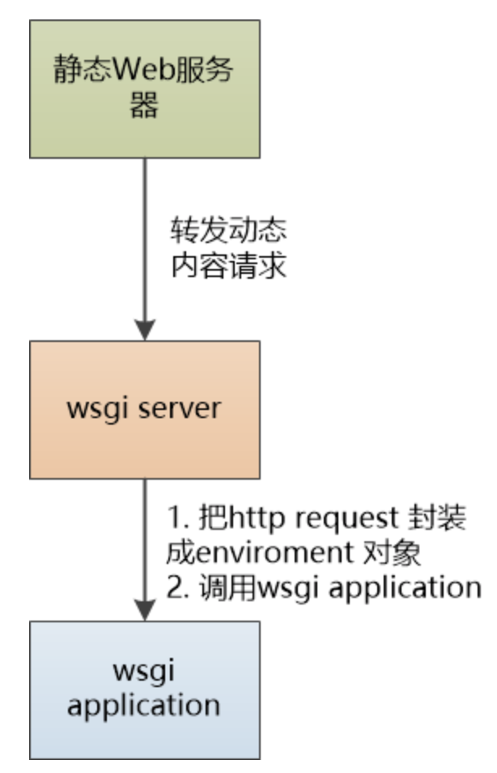

看看，是不是和Java 的Servlet 很像？（当然，忽略了很多细节。）

从本质上来说，都是为了关注点的分离：

1. 用一个动态内容服务器（wsgi server，Tomcat等）来接受并且封装HTTP 请求，降低程序员的负担。

2. 程序员只需要遵循约定（servlet,wsgi）就可以轻松实现自己的业务，不用关注系统的处理细节。

如果你先学的Java，通过Servlet理解了动态内容网站的本质和解决问题思路，再看到Python的wsgi，一眼就能看透，学起来飞快，反过来也是如此。

Web服务器的例子还比较简单，但是也体现出了这个道理：遇到问题要深度思考，努力看到本质，这样才能举一反三。

# 后端编程基础技术

语言不是重点，尤其是你已经会一门语言的情况下，后端编程最最基本的技术是这些：

## 1.浏览器和服务器是怎么打交道的？

重点就是HTTP协议。参考这个： [http-learning.md](http-learning.md) 

## 2. 理解url 和代码之间的关联

 例如 www.xxx.com?action=login 这样的url 是怎么和后端的业务代码关联起来的？

这样的规则是在哪里定义的？用代码、注解还是配置文件？

后端的业务代码是怎么组织的？相信现在不会有人把业务逻辑都写到Servlet当中了， 所以需要很多MVC 框架像Struts , SpringMVC 来组织代码，让系统清晰易懂。

https://app.yinxiang.com/fx/736f5b4a-2379-479f-9a9b-d04771b7a206和https://app.yinxiang.com/fx/c9b115f2-44ab-4ccd-9232-6d8fcc2732cb

在Java的世界里，最初是由**Servlet**来提供的。Servlet是Server、Applet的合成。

我们来看下**Servlet 的请求流程**，http://localhost:80/xxx1/xxx2：

1. 服务器解析请求信息：

   1. http:协议名称
   2. localhost:访问的是互联网中的哪一台计算机
   3. 80:从主机当中找到对应 80 端口的程序 （这里即为 Tomcat 服务器）
   4. /xxx1:当前项目的上下文路径 （即在 server.xml 中配置主机时配置的 path属性）
   5. /xxx2:当前请求的资源名

2. 解析Tomcat 服务器根目录下的config/server.xml文件：

   ```
   <Context docBase="D:\javaPros\test\webapp" path="xxx1" />
   ```

   1. 判断哪一个元素的path属性为xxx1
   2. - 若找不到，则返回 404错误
      - 若找到了，则解析该<Context />元素，得到docBase属性，获取当前访问 Web 项目的跟的绝对路径：D:\javaPros\test\webapp

3. 从D:\javaPros\test\webapp下的WEB-INF下找到web.xml文件,判断web.xml文件中是否有的文本内容为/xxx2
   1. 若找不到，则返回 404错误
   2. 若找到了，则继续获取该资源对应 Servlet 类的全限名称： xxx.xxx
4. 判断 Servlet 实例缓存池 中是否有 xxx.xxx 的对象
   1. 使用反射调用构造器，创建对应的对象obj = Class.forName("xxx.xxx").newInstance();把当前创建的 Servlet 对象，存放在缓存之中，供给下一次的使用.cache.put("xxx.xxx",obj);
   2. 创建 ServletConfig 对象，并调用 init() 方法 obj.init(config);
   3. 创建 ServletRequest 对象和 ServletResponse 对象，并调用 **service()**方法 obj.service(req,resp);
   4. 在 service() 方法中对浏览器作出响应操作。

这里完成了url和后端业务的绑定，可以使用**注解或者配置**文件，在config/server.xml的文件和项目的web.xml中。还需要掌握Servlet的生命周期。

## 3.数据的验证、转换和绑定

如何保证浏览器发过来的数据是符合要求的？例如不能为空、不超过8个字符、两个密码必须相等.... ， 出错了得给出错误提示。

浏览器发过来的数据都是形如username=liuxin&password=123456这样简单的文本， 但是后台程序却有着丰富的数据类型，什么String, Date ,Integer等等。所以需要把文本变成指定语言的类型，如何做转换？

类型转换以后， 后端的业务代码怎么才能有效的使用呢？

最简单的就是弄一个key : value 这个样的Map 出来， 业务代码直接用map.get(key) 即可，但是这样做缺乏“契约”，非常难以理解。

高级一点的可以把页面发来的数据直接绑定到对象的属性上， 并且支持数组，嵌套等复杂的结构。

例如user.name=liuxin&user.password=123456 可以绑定到一个叫User的对象， 其中有两个属性userName和password。

分别看Servlet和Spring的：

先来看Servlet的：我先找了几个Servlet的demo，比如登陆场景，都是调用getServletContext().getAttribute("username")方法，来获取的，那么在某个地方一定有setAttribute("username")方法。

https://docs.spring.io/spring/docs/5.0.0.M5/spring-framework-reference/html/validation.html

这个问题的答案在刘欣的《从零开始造Spring》有答案。把一个字符串转换成一个对象，是很麻烦的，但是挺有意思的。

BeanUtils.setProperty(bean,propertyName,propertyValue)

## 4. 数据库访问

这一块是比较麻烦的， 毕竟面向对象(OO)世界和关系(Relational)数据库之间存在着天然的鸿沟。

对于简单的应用， 直接写点JDBC就够用了，只需要掌握Connection, Statement , Resultset这三个基础。

复杂点的需要用O/R Mapping**(Object Relational Mapping)** 框架来搞定，例如 Hibernate, MyBatis ，还有RoR的ActiveRecord。

这其中比较棘手的就是表之间的关联， 就是所谓的一对多， 一对一， 多对多这样的关系， 如何在面向对象的世界里描述。

扩展开去，还需要处理连接池， 事务，锁 等各种烦人问题。

------

前面我们说了，把url中的请求中的字符串转变成为了对象，现在我们还需要把对象变成数据库中的数据，难搞啊。详细的看下面2篇文章。

https://mp.weixin.qq.com/s/Oduo_H_r9gJupzfivz0Q9g

https://mp.weixin.qq.com/s/ZER9trSczMnhqXl55ytyhA

## 5. 业务代码的执行

把业务代码放到哪里？代码该怎么组织？用事务脚本还是领域模型？贫血还是充血？

可以参考Spring项目结构。

参考《企业应用架构模式》的第九章。

感觉事务脚本还是领域模型这两个玩意就是面向过程和面向对象的两个说法。

https://cloud.tencent.com/developer/article/1103216

### 5.1 事务脚本(Transaction script)


## 6.如何把对象变成json和其他格式，让前端使用

原来的后端会用模板（JSP,Veloctiy ,FreeMaker等）生成页面，现在基本上是通过API提供数据了，需要把Java/Python对象变成JSON等格式来传输到前端。

------

借助于Gson这样的第三方库。**我们先来看解析**：

```java
Gson gson = new Gson();
int i = gson.fromJson("100", int.class); //100
double d = gson.fromJson("\"99.99\"", double.class);  //99.99
boolean b = gson.fromJson("true", boolean.class);     // true
String str = gson.fromJson("String", String.class);   // String
```

主要借fromJson这个方法来实现，我们会把json转换成StringReader对象。

```Java
StringReader reader = new StringReader(json);
T target = this.fromJson((Reader)reader, (Type)typeOfT);
return target;
```

然后把StringReader对象转换为JsonReader对象，

```Java
public <T> T fromJson(Reader json, Type typeOfT) throws JsonIOException, JsonSyntaxException {
    JsonReader jsonReader = this.newJsonReader(json);
    T object = this.fromJson(jsonReader, typeOfT);
    assertFullConsumption(object, jsonReader);
    return object;
}
```

最后会调用fromJson(JsonReader reader, Type typeOfT)方法。

```java
TypeToken<T> typeToken = (TypeToken<T>) TypeToken.get(typeOfT);
TypeAdapter<T> typeAdapter = getAdapter(typeToken);
T object = typeAdapter.read(reader);
return object;
```

在来看基本数据类型的生成：

```java
Gson gson = new Gson();
String jsonNumber = gson.toJson(100);       // 100
String jsonBoolean = gson.toJson(false);    // false
String jsonString = gson.toJson("String"); //"String"
```

再来看POJO类的生成与解析：

```java
public class User {
    //省略其它
    public String name;
    public int age;
    public String emailAddress;
}

// 生成JSON
Gson gson = new Gson();
User user = new User("张三",24);
String jsonObject = gson.toJson(user); // {"name":"张三kidou","age":24}
// 解析JSON
Gson gson = new Gson();
String jsonString = "{\"name\":\"张三\",\"age\":24}";
User user = gson.fromJson(jsonString, User.class);
```


来看：

```java
public String toJson(Object src) {
  if (src == null) {
    return toJson(JsonNull.INSTANCE);
  }
  return toJson(src, src.getClass());
}
```

接着，获取StringWriter对象，调用toJson(src, typeOfSrc, writer)，

```java
public String toJson(Object src, Type typeOfSrc) {
  StringWriter writer = new StringWriter();
  toJson(src, typeOfSrc, writer);
  return writer.toString();
}
```

再然后把StringWriter转换为Appendable：

```java
public void toJson(Object src, Type typeOfSrc, Appendable writer) throws JsonIOException {
  try {
    JsonWriter jsonWriter = newJsonWriter(Streams.writerForAppendable(writer));
    toJson(src, typeOfSrc, jsonWriter);
  } catch (IOException e) {
    throw new JsonIOException(e);
  }
}
```

再然后会把Appendable转化为JsonWriter，

```java
JsonWriter jsonWriter = newJsonWriter(Streams.writerForAppendable(writer));
```

最后调用下面的方法来完成：

```java
public void toJson(Object src, Type typeOfSrc, JsonWriter writer) throws JsonIOException {
  TypeAdapter<?> adapter = getAdapter(TypeToken.get(typeOfSrc));
  boolean oldLenient = writer.isLenient();
  writer.setLenient(true);
  boolean oldHtmlSafe = writer.isHtmlSafe();
  writer.setHtmlSafe(htmlSafe);
  boolean oldSerializeNulls = writer.getSerializeNulls();
  writer.setSerializeNulls(serializeNulls);
  try {
    ((TypeAdapter<Object>) adapter).write(writer, src);
  } catch (IOException e) {
    throw new JsonIOException(e);
  } catch (AssertionError e) {
    AssertionError error = new AssertionError("AssertionError (GSON " + GsonBuildConfig.VERSION + "): " + e.getMessage());
    error.initCause(e);
    throw error;
  } finally {
    writer.setLenient(oldLenient);
    writer.setHtmlSafe(oldHtmlSafe);
    writer.setSerializeNulls(oldSerializeNulls);
  }
}
```

总结，通过Gson，fastjson这样的库，我们可以完成java对象和json数据之间的转换。

## 前后端分离方案

最早是前后端耦合在一块，就是JSP那一套。然后提出前后端分离，由以下[2中方案](https://zhuanlan.zhihu.com/p/110038951)。

- 前端维护html

- - 静态资源完全由nginx托管。*js,css 和 index.html放在同一个`dist`*
  - 静态资源上传CDN，Nginx只提供`index.html`

```
server {
    listen       80;
    server_name  localhost;

    location / {
        root   /app/dist; # 打包的路径
        index  index.html index.htm;
        try_files $uri $uri/ /index.html; # 单页应用防止重刷新返回404，如果是多页应用则无需这条命令
    }

    location /api {
        proxy_pass https://anata.me; #后台转发地址
        proxy_set_header   X-Forwarded-Proto $scheme;
        proxy_set_header   X-Real-IP         $remote_addr;
    }
}
```

- 后端维护html：需要渲染的页面带上后端注入的动态数据，又或者页面需要支持SEO，只能由后端来渲染。

```
<!doctype html>
<html>
<head>
    <meta charset="utf-8">
    <meta name="viewport" content="width=device-width,initial-scale=1">
    <meta name="mobile-web-app-capable" content="yes">
    <style>
        #app {
            height: 100%;
        }
    </style>

    <script type="text/javascript">
        window.csrfToken = "${csrfToken}";
        window.GlobalConfig = {
            userInfo: {
                nick: "${nickname}",
                workNo: "${empId}",
                business: "${business}"
            },
            logout: "/",
            baseURL: "",
            aclUrl: "${aclUrl}",
        }
    </script>
    <link href="${cdnUrl}/main.css" rel="stylesheet">
</head>
<body>
<div id="app"></div>
<script type="text/javascript" src="${cdnUrl}/.dll.js"></script>
<script type="text/javascript" src="${cdnUrl}/main.js"></script>
</body>
</html>
```

# 7. 总结

搞定了前面这几点，就搞定了一个基本的网站后端了。

如果你仅仅是想了解下后端编程是什么样子，可以直接去学学框架，Java可以直接学Springboot，MyBatis， Python可以学Django, Flask，这些框架的抽象程度和封装程度都非常高，把上面所说的技术点都给屏蔽了，只要会用，就能开发后端程序。

如果你想深入学习后端编程，强烈建议：不要一上来就学框架。

要先用这些语言提供的最基本的能力，把这些技术点自己做一下，然后进入框架的世界，这样理解会非常深刻。

例如Java， 它提供了Web开发最最基本的功能：Servlet 和JDBC，Python也是类似，有WSGI, PyMySQL可以直接使用，用他们就可以做URL和代码的映射，数据的转换和绑定，数据库的访问。
