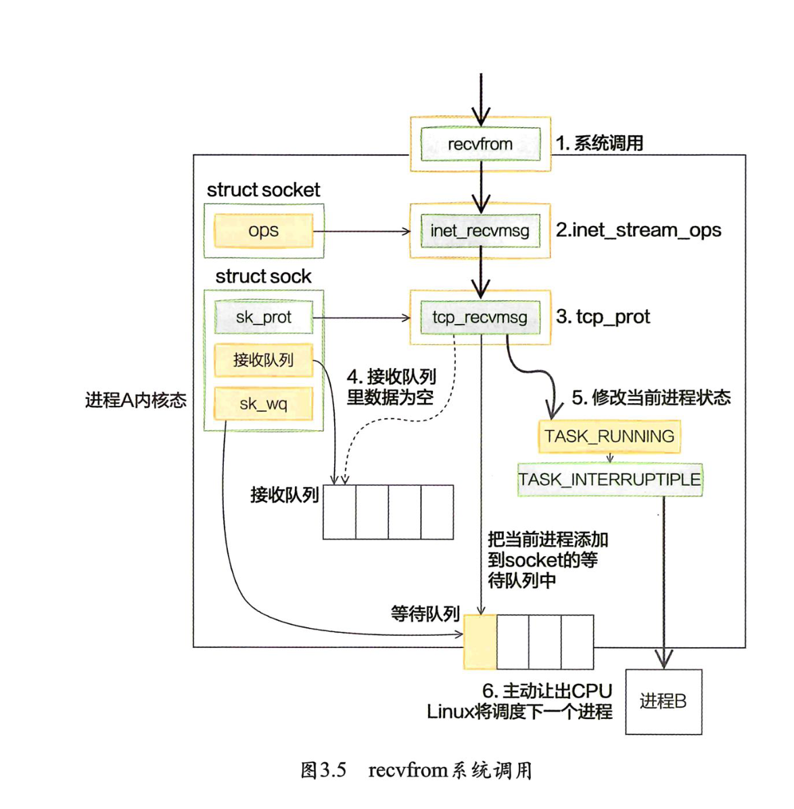

# 内核如何接收网络包

1. RingngBuffer到底是什么，RingBuffer为什么会丟包?

卡在收到数据的时候以DMA的方式将包写到RingBuffer中。软中断收包的时候来这里把skb取走，并申请新的skb重新挂上去。

2. 网络相关的硬中断。软中断都是什么?

在网卡将数据放到RingBuffer中后，接着就发起硬中断，通知CPU进行处理。不过在硬中断的上下文里做的工作很少，将传过来的polLis添加到了CPU变量soitnet data的 poll list里 (softnet data中的poll list是一个双向列表，其中的设备都带有输入帧等着被处理)，接着触发软中断NET_RX_ SOFTIRQ。在软中断中对sortnet data的设备列表poll list进行遍历，执行网卡驱动提供的pol来收取网络包。处理完后会送到协议栈的ip_ rov、udp_ rov、tep_rov_ v4等函数中。

3.  Linux里的ksoftirad内核线程是干什么的?

内核线程ksotirad包含了所有的软中断处理逻辑。

4. 为什么网卡开启多队列能提升网络性能?

将各个队列的硬中断打散到不同的CPU上就行了。这样硬中断后面的软中断CPU开销也将由多个核来分担。

5. tcpdump是如何工作的?

tcpdump工作在设备层，是通过虛拟协议的方式工作的。

6. tcpdump 能否抓到被 iptable 封禁的包?

tcpdump工作在设备层，将包送到P层以前就能 处理。而netilter工作在IP、ARP等层。从图2.13收包流程处理顺序上来看，netfilter是在tcpdump后面工作的，所以iptable封禁规则影响不到tcpdump的抓包。

# 内核是如何与用户进程协作的

## 同步阻塞

等待接收消息

这会导致一次进程上下文的开销，而这个开销是昂贵的，大约需要消耗几个微秒的CPU时间。

同步阻塞方式接收网络包的整个过程分为两部分:

- 第一部分是我们自己的代码所在的进程，我们调用的socket函数会进入内核态创建必要内核对象。recv函数在进入内核态以后负责查看接收队列，以及在没有数据可处理的时候把当前进程阻塞掉，让出CPU。

- 第二部分是硬中断、软中断上下文。在这些组件中，将包处理完后会放到socket的接收队列中。然后根据socket内核对象找到其等待队列中正在因为等待而被阻塞掉的进程，把它唤醒。

每个用户维护一个链接/进程。这是不可忍受的。

## epoll

一个进程为上万用户服务。

- 用户进程内核态。调用epoll wait等函数时会将进程陷入内核态来执行。这部分代 码负责查看接收B人列，以及负责把当前进程阻塞掉，让出CPU。
- 硬、软中断上下文。在这些组件中，将包从网卡接收过来进行处理，然后放到 socket的接收队列。对于epoll来说，再找到socket关联的epitem，并把它添加到epoll对象的就绪链表中。这个时候再捎带检查一下epoll上是否有被阻塞的进程，如果有唤醒它。

1. 阻塞到底是怎么一回事?

   用户进程有没有放弃 CPU 。

2. 同步阻塞IO都需要哪些开销?

   - 通过recv系统调用接收一个socket 上的数据时，如果数据没有达到，进程就被从CPU上拿下来，然后再换上另一个进程。这导致一次进程上下文切换的开销。 
   - 当连接上的数据就绪的时候，睡眠的进程又会被唤醒，又是一次进程切换的开销。
   - 一个进程同时只能等待一条连接，如果有很多并发，则需要很多进程。每个进程都将占用大约几MB的内存。

   从CPU 开销角度，一次同步阻塞 IO 导致两次进程上下文切换开销。

   一个进程一次处理一个 socket，单台机器是无法创建出上万个 socket 。

3. 多路复用epoll为什么就能提高网络性能?

   极大程度地减少了无用的进程上下文切换，让进程更专注地处理网络请求。

# 内核是如何发送网络包的

- 发送网络数据的时候都涉及哪些内存拷⻉操作?

  这里的内存拷贝，只特指待发送数据的内存拷贝。

  第一次拷贝操作是在内核申请完skD之后，这时候会将用户传递进来的buffer里的数据内容都拷贝到skb。如果要发送的数据量比较大，这个拷贝操作开销还是不小的。
  第二次拷贝操作是人传输层进入网络层的时候，每一个skb都会被克隆出来一个新的副本。目的是保存原始的skb，当网络对方没有发回ACK的时候，还可以重新发送，以实现TCP中要求的可靠传输。不过这次只是浅拷贝，只拷贝skb描述符本身，所指向的数据还是复用的。
  第三次拷贝不是必需的，只有当IP层发现skb大于MTU时才需要进行。此时会再申请额外的skD，并将原来的skD拷贝为多个小的skb。
  这里插个题外话，大家在谈论网络性能优化中经常听到 “零搭贝〞，我觉得这个词有一点点夸张的成分。TCP为了保证可靠性，第二次的拷贝根本就没法省。如果包大于MTU，分片时的拷贝同样避免不了。

- 零拷贝到底是怎么回事?

  如果想把本机的一个文件通过网络发送出去，我们的做法之一就是先用 read系统调用把文件读取到内存，然后再调用send把文件发送出去。
   假设数据之前从来没有读取过，那么read 硬盘上的数据需要经过两次拷贝才能到用户进程的内存。第一次是从硬盘DMA到Page Cache。 第二次是从Page Cache拷贝到用户内存。send系统调用在前面讲过了。那么read + send系统调用发送一个文件出去数据需

  要经过的拷贝过程如图4.24所示。

  

  如果要发送的数据量比较大，那需要花费不少的时间在大量的数据拷贝上。前面提到的sendfile就是内核提供的一个可用来减少发送文件时拷贝开销的一个技术方案。 在sendtile系统调用里，数据不需要拷贝到用户空间，在内校态就能完成发送处理，如图4.25所示，这就显著减少了需要拷贝的次数。

  

- 为什么Kafka的网络性能很突出?

kafka高性能的原因有很多，其中的重要原因之一就是采用了sendfile系统调用来发送网络数据包，减少了内核态和用户态的频繁数据拷贝。

# 深度理解本机网络

