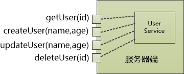
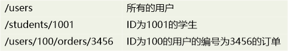
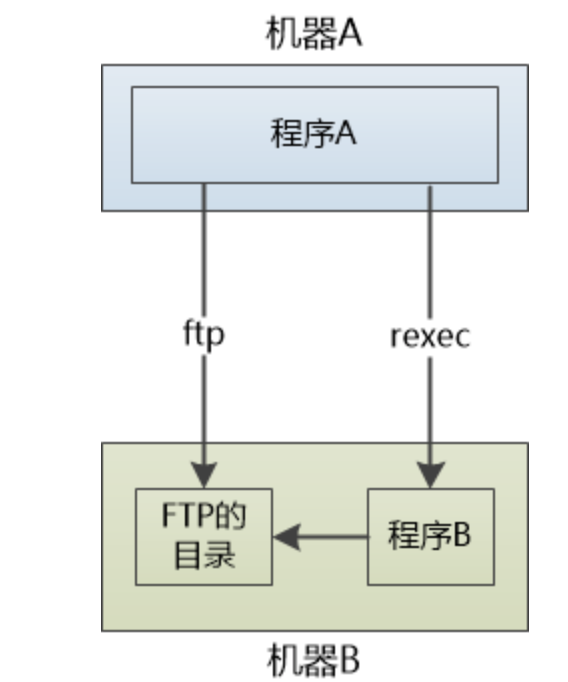
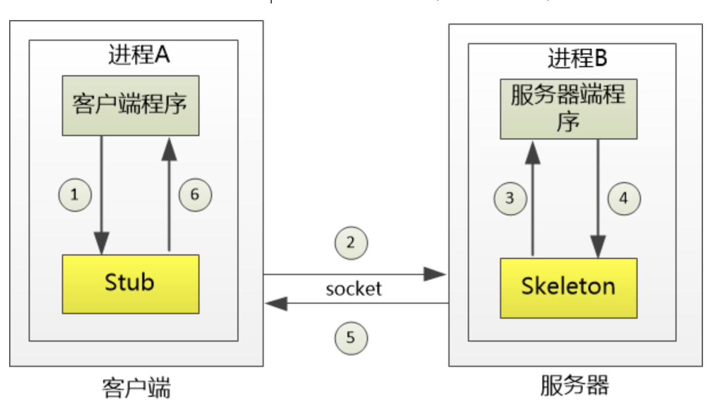
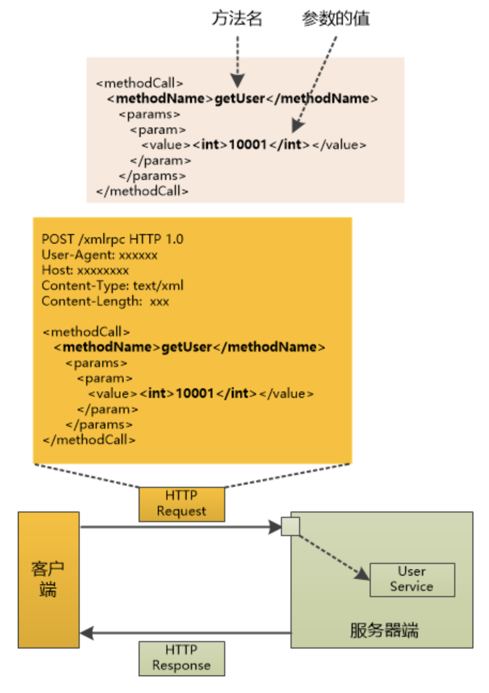
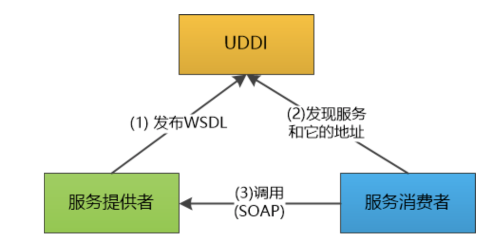

# 常见协议之间的区别

socket，http，rpc

## http vs RPC

其实http和rpc根本不是一个维度的事情，rpc主要用在微服务中，rpc底层可以使用http，也可以基于TCP/IP协议自己来实现。https://mp.weixin.qq.com/s/OXIFJGSozoRWNaLhnD0wxw，而RMI是RPC在Java中的一种实现。

当我们把服务端当做函数的集合时，就是RPC。当做资源的集合时就是HTTP RESTful API。https://mp.weixin.qq.com/s/lmtcMxyOCGB11syWbG0e_g

## http vs socket

再来看下http和socket之间的关系，由于TCP和UDP是很复杂的，三次握手，四次挥手啊，滑动窗口啊，为了便于使用，大牛们使用socket实现了TCP/UDP协议，而http就可以在socket的基础上来实现了。

## socket vs websocket

websocket的演化参考：https://haojunsheng.github.io/2019/12/http-learning/和https://app.yinxiang.com/fx/a4e8974d-6d8c-422b-93fd-976fb4677b18

socket是封装了TCP和UDP。websocket是为了优化http而产生的，采用全双工通信，可以主动推送数据，减少了通信量。

# RPC发展简史

https://app.yinxiang.com/fx/00dd1d56-9528-41f7-bd1d-f6f93c150aa0

我们想在不同的电脑上来传输数据，应该怎么办呢？

在最早期的时候，我们是通过**ftp**来做的，像是下面这样，机器A通过ftp， 上传一个文件到机器B的指定路径，然后再让rexec 去调用机器B上的程序，这程序是程序员写的，可以读取FTP目录下的文件，执行业务逻辑就行了。”

rexec [remote_host] [command] 

然后，CORBA（Common Object Request Broker Architecture）和Java RMI出现了。自动生成客户端代理和服务器端代理，这两个代理完成了大量的脏活和累活，比如：网络通信，参数序列化。称之为Stub(客户端代理)和Skeleton(服务器端代理)。这个Stub代理提供了和服务器一模一样的接口，客户端程序只要调用它，它就会把请求发到服务器端的Skeleton代理进行处理。 所以对于客户端程序来说，网络不可见，就像是调用本地的方法一样。

但是问题在于，只能存在于Java中，更重要的是客户端和服务器紧密绑定，服务器端的变化，都必须得重新生成Stub和Skeleton。

我们需要找到一个办法，**让服务器端独立变化，而不影响客户端**。于是引入了XML-RPC。

我们通过HTTP Post把这个XML发送到服务器端，服务器端进行解析，获取方法名称和参数的值，调用真正的方法，把结果也以XML形式返回， 客户端收到以后再解析就可以得到结果了。  

这样客户端和服务器端就变成松耦合的了，如果服务器端想添加一个新的接口，客户端就不用做变化了。

但是我们知道xml的缺陷是，1是太灵活，2是浪费资源。有人引入了SOAP。把一个服务器对外提供的接口也用XML精确地描述下来，任何程序，只要读取这个XML文件，就知道接口的方法名，参数名。可以支持HTTP, SMTP ，TCP，UDP等协议。

这个玩意就是微软的Web Service。

但是这个玩意太过于复杂，太难用了。有人提议还是用之前的http，只是返回json数据，而不是复杂的xml。

有人提议不再把服务器看成函数的集合，而是资源的集合。这就引入了restful。

https://app.yinxiang.com/fx/248918f0-0787-4fea-aff3-92ca41adfdc0

但是restful也存在很大的弊端，查询的时候不是很灵活。
