<!--ts-->
   * [unix网络编程套接字互联网API](#unix网络编程套接字互联网api)
   * [前言](#前言)
   * [Unix系统编程之文件](#unix系统编程之文件)
      * [文件描述符](#文件描述符)
   * [6. I/O复用：select和poll函数](#6-io复用select和poll函数)
      * [6.1 概述](#61-概述)
      * [6.2 I/O模型](#62-io模型)
         * [6.2.1 <strong>阻塞式I/O模型</strong>](#621-阻塞式io模型)
         * [6.2.2. <strong>非阻塞式I/O模型</strong>](#622-非阻塞式io模型)
         * [6.2.3 I/O复用模型(select/poll)](#623-io复用模型selectpoll)
         * [6.2.4 <strong>信号驱动式I/O模型(sigio)</strong>](#624-信号驱动式io模型sigio)
         * [<strong>6.2.5 异步I/O模型(POSIX的aio_系列函数)</strong>](#625-异步io模型posix的aio_系列函数)
         * [<strong>6.2.6 各种I/O模型的比较</strong>](#626-各种io模型的比较)
         * [<strong>6.2.7 同步I/O和异步I/O对比</strong>](#627-同步io和异步io对比)
      * [6.3 <strong>select函数</strong>](#63-select函数)
         * [6.3.1 描述符就绪条件](#631-描述符就绪条件)
         * [6.3.2 <strong>select的最大描述符数</strong>](#632-select的最大描述符数)
      * [6.4 <strong>str_cli函数</strong>](#64-str_cli函数)
      * [6.9 pselect函数](#69-pselect函数)
      * [6.10 <strong>poll函数</strong>](#610-poll函数)
      * [6.11 总结](#611-总结)
         * [select](#select)
         * [poll](#poll)
         * [epoll](#epoll)
            * [epoll操作过程](#epoll操作过程)
            * [工作模式](#工作模式)
            * [代码演示](#代码演示)
            * [epoll总结](#epoll总结)
   * [16. <strong>非阻塞式I/O</strong>](#16-非阻塞式io)
      * [16.1 概述](#161-概述)
      * [<strong>16.2 非阻塞读和写：str_cli函数（修订版）</strong>](#162-非阻塞读和写str_cli函数修订版)
      * [<strong>16.3 非阻塞connect</strong>](#163-非阻塞connect)
      * [<strong>16.4 非阻塞connect：时间获取客户程序</strong>](#164-非阻塞connect时间获取客户程序)
      * [<strong>16.5 非阻塞connect：Web客户程序</strong>](#165-非阻塞connectweb客户程序)
   * [25. <strong>信号驱动式I/O</strong>](#25-信号驱动式io)
      * [<strong>25.1 概述</strong>](#251-概述)
      * [25.2 <strong>套接字的信号驱动式I/O</strong>](#252-套接字的信号驱动式io)
      * [<strong>25.3 使用SIGIO的UDP回射服务器程序</strong>](#253-使用sigio的udp回射服务器程序)
      * [<strong>25.4 小结</strong>](#254-小结)
   * [26.](#26)

<!-- Added by: anapodoton, at: Sun Mar  1 22:02:21 CST 2020 -->

<!--te-->

# unix网络编程套接字互联网API

# 前言

本机是文件描述符(Unix I/O)，然后跨主机需要使用socket编程。这个时候我们就可以在两台电脑进行通信。然后我们构建了支持html语言的www服务器，使用http协议来传输。这个时候，服务器只可以传递静态内容，我们是需要动态服务器的，我们引入了CGI技术。不甘心CGI技术独霸天下，Java引入了Servlet技术。后面在服务器的基础上，又演化出了容器技术，比如tomcat，spring等容器。

socket是对TCP/IP的抽象， 网络编程肯定绕不过socket，绝大部分语言都提供了socket相关的API。 

工作中直接对socket编程的机会不多，大多都是封装好的， 但是要理解socket在客户端和服务器端的区别，服务器端是如何维护连接的， 这就会引出一个重要的技术：I/O多路复用（select/poll/epoll) ，也是ngnix,redis等著名软件的基础。 

I/O多路复用是I/O模型之一，其他还有同步阻塞，同步非阻塞，信号驱动和异步。 

这方面最经典的书应该是《Unix网络编程》。 

《linux系统编程》

这本书实在是太厚了，学下重要章节就好了。


http://beej-cn.netdpi.net/


http://beej.us/guide/bgnet/


# Unix系统编程之文件

我们为什么要学这一节呢？因为在Unix系统中，所有的都是文件，都离不开文件描述符。socket也不意外。所以在我们学习socket之前，我们需要学习文件描述符。

我们先来看基础的：系统编程三大基石，系统调用，C库和C编译器。

## 文件描述符

我们来看文件描述符：

对于内核而言，所有打开文件都由文件描述符引用。文件描述符是一个非负整数。当打开一个现存文件或创建一个新文件时，内核向进程返回一个文件描述符。当读、写一个文件时，用open或creat返回的文件描述符标识该文件，将其作为参数传送给read或write。
按照惯例，UNIX shell使文件描述符0与进程的标准输入相结合，文件描述符1与标准输出相结合，文件描述符2与标准出错输出相结合。

# 6. I/O复用：select和poll函数

这个玩意是比较重要的，很多地方都是直接抄的这本书。

## 6.1 概述

我们先来看下什么是I/O复用：I/O multiplexing，指的是内核一旦发现进程指定的一个或者多个I/O条件就绪（也就是说输入已准备好被读取，或者描述符已能承接更多的输出），它就通知进程。这个能力称为I/O复用。由select和poll这两个函数支持的。

有些系统提供了更为先进的让进程在一串事件上等待的机制。轮询设备（poll device）就是这样的机制之一。

下面我们看下I/O多路复用的场景：

- 当客户处理多个描述符（通常是交互式输入和网络套接字）时，必须使用I/O复用。
  - 一个客户同时处理多个套接字是可能的，不过比较少见。16.5节中结合web的上下文给出这种场合使用select的例子。
- 如果一个TCP服务器既要处理监听套接字，又要处理已连接套接字，一般就要使用I/O复用。6.8节
- 如果一个服务器即要处理TCP，又要处理UDP，一般就要使用I/O复用。18.5节
- 如果一个服务器要处理多个服务或者多个协议（例如我们将在13.5节讲述的inetd守护进程），一般就要使用I/O复用。

此外，I/O复用不仅用在网络编程，很多其他的技术也在用。

## 6.2 I/O模型

在进入主题之前，我们先来看下linux下可用的五种I/O模型之间的区别。

一个输入操作通常包括两个不同的阶段：

(1) 等待数据准备好；

(2) 从内核向进程复制数据。

对于一个套接字上的输入操作，第一步通常涉及等待数据从网络中到达。当所等待分组到达时，它被复制到内核中的某个缓冲区。第二步就是把数据从内核缓冲区复制到应用进程缓冲区。

### 6.2.1 **阻塞式I/O模型**

最流行的I/O模型是阻塞式I/O（blocking I/O）模型，本书到目前为止的所有例子都使用该模型。默认情形下，所有套接字都是阻塞的。以数据报套接字作为例子，我们有如图6-1所示的情形。

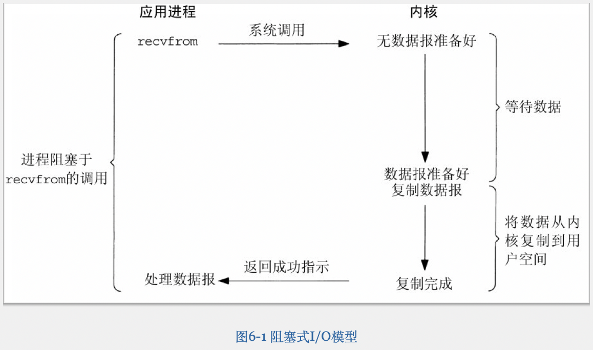

我们使用UDP而不是TCP作为例子的原因在于就UDP而言，数据准备好读取的概念比较简单：要么整个数据报已经收到，要么还没有。然而对于TCP来说，诸如套接字低水位标记（low-water mark）等额外变量开始起作用，导致这个概念变得复杂。

在本节的例子中，我们把recvfrom(类似于read)函数视为系统调用，因为我们正在区分应用进程和内核。不论它如何实现（在源自Berkeley的内核上是作为系统调用，在System V内核上是作为调用系统调用getmsg的函数），一般都会从在应用进程空间中运行切换到在内核空间中运行，一段时间之后再切换回来。

在图6-1中，进程调用recvfrom，其系统调用直到数据报到达且被复制到应用进程的缓冲区中或者发生错误才返回。最常见的错误是系统调用被信号中断，如5.9节所述。我们说进程在从调用recvfrom开始到它返回的整段时间内是被阻塞的。recvfrom成功返回后，应用进程开始处理数据报。

### 6.2.2. **非阻塞式I/O模型**

进程把一个套接字设置成非阻塞是在通知内核：当所请求的I/O操作非得把本进程投入睡眠才能完成时，不要把本进程投入睡眠，**而是返回一个错误**。我们将在第16章中详细介绍非阻塞式I/O（nonblocking I/O），不过图6-2概要展示了我们即将考虑的例子。

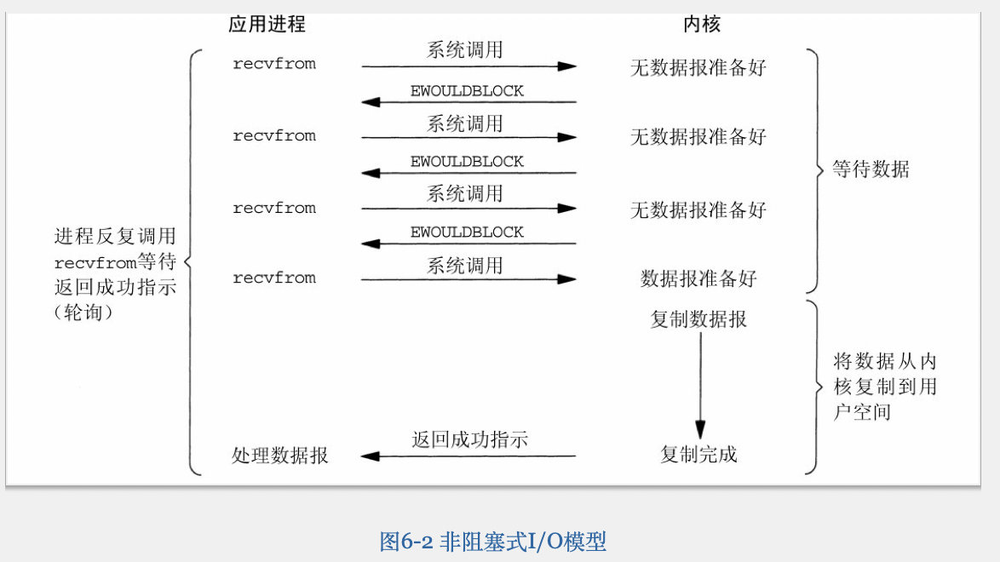

前三次调用recvfrom时没有数据可返回，因此内核转而立即返回一个EWOULDBLOCK错误。第四次调用recvfrom时已有一个数据报准备好，它被复制到应用进程缓冲区，于是recvfrom成功返回。我们接着处理数据。

当一个应用进程像这样对一个非阻塞描述符循环调用recvfrom时，我们称之为轮询（polling）。应用进程持续轮询内核，以查看某个操作是否就绪。这么做往往耗费大量CPU时间，不过这种模型偶尔也会遇到，通常是在专门提供某一种功能的系统中才有。

### 6.2.3 I/O复用模型(select/poll)

有了I/O复用（I/O multiplexing），我们就可以调用select或poll，阻塞在这两个系统调用中的某一个之上，而不是阻塞在真正的I/O系统调用上。图6-3概括展示了I/O复用模型。

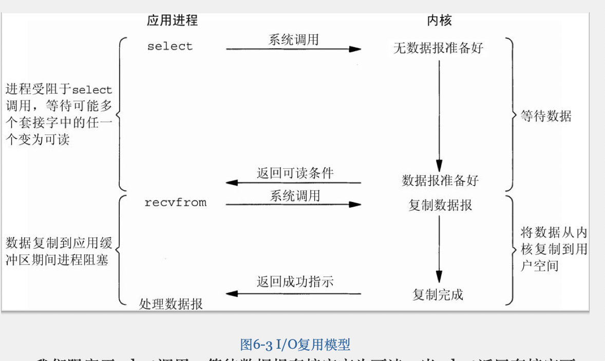

我们阻塞于select调用，等待数据报套接字变为可读。当select返回套接字可读这一条件时，我们调用recvfrom把所读数据报复制到应用进程缓冲区。

比较图6-3和图6-1，I/O复用并不显得有什么优势（注意recvfrom的时间），事实上由于使用select需要两个而不是单个系统调用，I/O复用还稍有劣势。不过我们将在本章稍后看到，**使用select的优势在于我们可以等待多个描述符就绪**。

与I/O复用密切相关的另一种I/O模型是在多线程中使用阻塞式I/O。这种模型与上述模型极为相似，但它没有使用select阻塞在多个文件描述符上，而是使用多个线程（每个文件描述符一个线程），这样每个线程都可以自由地调用诸如recvfrom之类的阻塞式I/O系统调用了。

### 6.2.4 **信号驱动式I/O模型(sigio)**

我们也可以用信号，让内核在描述符就绪时发送SIGIO信号通知我们。我们称这种模型为信号驱动式I/O（signal-driven I/O），图6-4是它的概要展示。

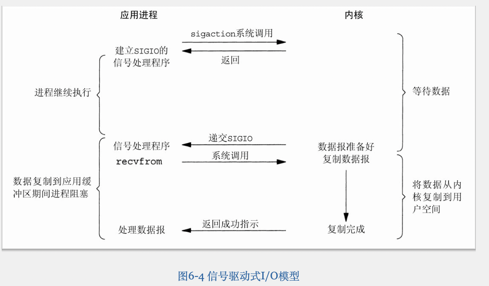

我们首先开启套接字的信号驱动式I/O功能（我们将在25.2节讲解这个过程），并通过sigaction系统调用安装一个信号处理函数。该系统调用将立即返回，我们的进程继续工作，也就是说它没有被阻塞。当数据报准备好读取时，内核就为该进程产生一个SIGIO信号。我们随后既可以在信号处理函数中调用recvfrom读取数据报，并通知主循环数据已准备好待处理（这正是我们将在25.3节中所要做的事情），也可以立即通知主循环，让它读取数据报。

无论如何处理SIGIO信号，这种模型的优势在于等待数据报到达期间进程不被阻塞。主循环可以继续执行，只要等待来自信号处理函数的通知：既可以是数据已准备好被处理，也可以是数据报已准备好被读取。

### **6.2.5 异步I/O模型(POSIX的aio_系列函数)**

异步I/O（asynchronous I/O）由POSIX规范定义。演变成当前POSIX规范的各种早期标准所定义的实时函数中存在的差异已经取得一致。一般地说，这些函数的工作机制是：告知内核启动某个操作，并让内核在整个操作（包括将数据从内核复制到我们自己的缓冲区）完成后通知我们。这种模型与前一节介绍的信号驱动模型的主要区别在于：信号驱动式I/O是由内核通知我们何时可以启动一个I/O操作，而异步I/O模型是由内核通知我们I/O操作何时完成。图6-5给出了一个例子。

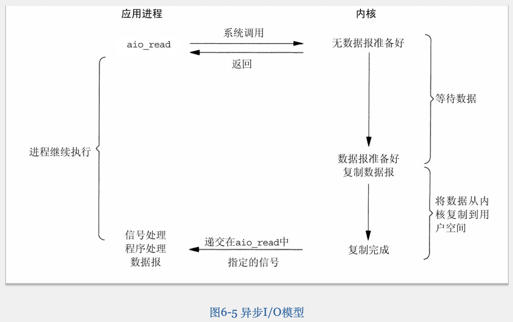

我们调用aio_read函数（POSIX异步I/O函数以aio_或lio_开头），给内核传递描述符、缓冲区指针、缓冲区大小（与read相同的三个参数）和文件偏移（与lseek类似），并告诉内核当整个操作完成时如何通知我们。该系统调用立即返回，而且在等待I/O完成期间，我们的进程不被阻塞。本例子中我们假设要求内核在操作完成时产生某个信号。该信号直到数据已复制到应用进程缓冲区才产生，这一点不同于信号驱动式I/O模型。

本书编写至此的时候，支持POSIX异步I/O模型的系统仍较罕见。我们不能确定这样的系统是否支持套接字上的这种模型。这儿我们只是用它作为一个与信号驱动式I/O模型相比照的例子。

### **6.2.6 各种I/O模型的比较**

图6-6对比了上述5种不同的I/O模型。可以看出，前4种模型的主要区别在于第一阶段，因为它们的第二阶段是一样的：在数据从内核复制到调用者的缓冲区期间，进程阻塞于recvfrom调用。相反，异步I/O模型在这两个阶段都要处理，从而不同于其他4种模型。

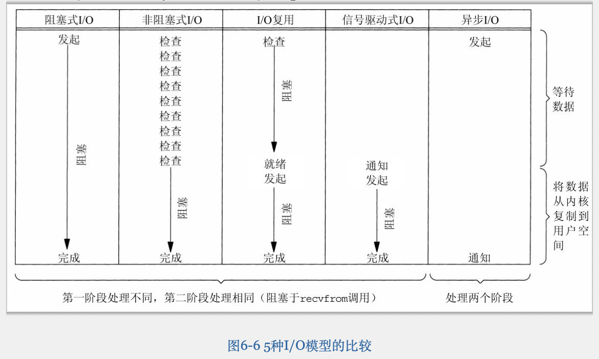

### **6.2.7 同步I/O和异步I/O对比**

POSIX把这两个术语定义如下：

同步I/O操作（synchronous I/O opetation）导致请求进程阻塞，直到I/O操作完成；

根据上述定义，我们的前4种模型——阻塞式I/O模型、非阻塞式I/O模型、I/O复用模型和信号驱动式I/O模型都是同步I/O模型，因为其中真正的I/O操作（recvfrom）将阻塞进程。只有异步I/O模型与POSIX定义的异步I/O相匹配。

## 6.3 **select函数**

我们不在阻塞在系统I/O上，而是阻塞在select上。这个教程不错：http://beej-cn.netdpi.net/07-advanced-technology/7-2-select

该函数允许进程指示内核等待多个事件中的任何一个发生，并只在有一个或多个事件发生或经历一段指定的时间后才唤醒它。

作为一个例子，我们可以调用select，告知内核仅在下列情况发生时才返回：

- 集合{1，4，5}中的任何描述符准备好读；

- 集合{2，7}中的任何描述符准备好写；

- 集合{1，4}中的任何描述符有异常条件待处理；

- 已经历了10.2秒。

也就是说，我们调用select告知内核对哪些描述符（就读、写或异常条件）感兴趣以及等待多长时间。我们感兴趣的描述符不局限于套接字，任何描述符都可以使用select来测试。

```cpp
#include <sys/select.h>
#include <sys/time.h>
// 返回：若有就绪描述符则为其数目，若超时则为0，若出错则为-1
int select(int maxfdp1, fd_set *readset, fd_set *writeset, fd_set *exceptset,
const struct timeval *timeout);
```

我们从该函数的最后一个参数timeout开始介绍，它告知内核等待所指定描述符中的任何一个就绪可花多长时间。其timeval结构用于指定这段时间的秒数和微秒数。

```cpp
struct timeval {

long　 tv_sec;　　　/* seconds */

long　 tv_usec;　　/* microseconds */

};
```

这个参数有以下三种可能。

(1) 永远等待下去：仅在有一个描述符准备好I/O时才返回。为此，我们把该参数设置为空指针。

(2) 等待一段固定时间：在有一个描述符准备好I/O时返回，但是不超过由该参数所指向的timeval结构中指定的秒数和微秒数。

(3) 根本不等待：检查描述符后立即返回，这称为**轮询（polling）**。为此，该参数必须指向一个timeval结构，而且其中的定时器值（由该结构指定的秒数和微秒数）必须为0。

前两种情形的等待通常会被进程在等待期间捕获的信号中断，并从信号处理函数返回。

尽管timeval结构允许我们指定了一个微秒级的分辨率，然而内核支持的真实分辨率往往粗糙得多。举例来说，许多Unix内核把超时值向上舍入成10 ms的倍数。另外还涉及调度延迟，也就是说定时器时间到后，内核还需花一点时间调度相应进程运行。

timeout参数的const限定词表示它在函数返回时不会被select修改。举例来说，如果我们指定一个10s的超时值，不过在定时器到时之前select就返回了（结果可能是有一个或多个描述符就绪，也可能是得到EINTR错误），那么timeout参数所指向的timeval结构不会被更新成该函数返回时剩余的秒数。如果我们需要知道这个值，那么必须在调用select之前取得系统时间，它返回后再取得系统时间，两者相减就是该值（任何健壮的程序都得考虑到系统时间可能在这段时间内偶尔会被管理员或ntpd之类守护进程调整）。

中间的三个参数readset、writeset和exceptset指定我们要让**内核测试读、写和异常条件的描述符**。目前支持的异常条件只有两个：

(1) 某个套接字的带外数据的到达，我们将在第24章中详细讲述这个异常条件；

(2) 某个已置为分组模式的伪终端存在可从其主端读取的控制状态信息，本书不讨论伪终端。

如何给这3个参数中的每一个参数指定一个或多个描述符值是一个设计上的问题。select使用描述符集，通常是一个整数数组，其中每个整数中的每一位对应一个描述符。举例来说，假设使用32位整数，那么该数组的第一个元素对应于描述符0～31，第二个元素对应于描述符32～63，依此类推。所有这些实现细节都与应用程序无关，它们隐藏在名为fd_set的数据类型和以下四个宏中：

```cpp
void FD_ZERO(fd_set *fdset);　　　　　　 /* clear all bits in fdset */

void FD_SET(int fd, fd_set *fdset);　　 /* turn on the bit for fd in fdset */

void FD_CLR(int fd, fd_set *fdset);　　 /* trun off the bit for fd in fdset */

int　FD_ISSET(int fd, fd_set *fdset);　 /* is the bit for fd on in fdset */
```

我们分配一个fd_set数据类型的描述符集，并用这些宏设置或测试该集合中的每一位，也可以用C语言中的赋值语句把它赋值成另外一个描述符集。

举个例子，以下代码用于定义一个fd_set类型的变量，然后打开描述符1、4和5的对应位：

```cpp
fd_set　rset;

FD_ZERO(&rset);　　　　 /* initialize the set：all bits off */

FD_SET(1, &rset);　　　 /* turn on bit for fd 1 */

FD_SET(4, &rset);　　　 /* turn on bit for fd 4 */

FD_SET(5, &rset);　　　 /* turn on bit for fd 5 */
```

描述符集的初始化非常重要，因为作为自动变量分配的一个描述符集如果没有初始化，那么可能发生不可预期的后果。

select函数的中间三个参数readset、writeset和exceptset中，如果我们对某一个的条件不感兴趣，就可以把它设为空指针。事实上，如果这三个指针均为空，我们就有了一个比Unix的sleep函数更为精确的定时器（sleep睡眠以秒为最小单位）。poll函数提供类似的功能。APUE的图C-9和图C-10给出了一个使用select和poll实现的sleep_us函数，它的睡眠以微秒为单位。

maxfdp1参数指定待测试的描述符个数，它的值是待测试的最大描述符加1（因此我们把该参数命名为maxfdp1），描述符0, 1, 2, …，一直到maxfdp1-1均将被测试。

头文件<sys/select.h>中定义的FD_SETSIZE常值是数据类型fd_set中的描述符总数，其值通常是1024，不过很少有程序用到那么多的描述符。maxfdp1参数迫使我们计算出所关心的最大描述符并告知内核该值。以前面给出的打开描述符1、4和5的代码为例，其maxfdp1值就是6。是6而不是5的原因在于：我们指定的是描述符的个数而非最大值，而描述符是从0开始的。

存在这个参数以及计算其值的额外负担纯粹是为了效率原因。每个fd_set都有表示大量描述符（典型数量为1024）的空间，然而一个普通进程所用的数量却少得多。内核正是通过在进程与内核之间不复制描述符集中不必要的部分，从而不测试总为0的那些位来提高效率的（TCPv2的16.13节）。

select函数修改由指针readset、writeset和exceptset所指向的描述符集，因而这三个参数都是值—结果参数。调用该函数时，我们指定所关心的描述符的值，该函数返回时，结果将指示哪些描述符已就绪。该函数返回后，我们使用FD_ISSET宏来测试fd_set数据类型中的描述符。描述符集内任何与未就绪描述符对应的位返回时均清成0。为此，每次重新调用select函数时，我们都得再次把所有描述符集内所关心的位均置为1。

使用select时最常见的两个编程错误是：忘了对最大描述符加1；忘了描述符集是值-结果参数。第二个错误导致调用select时，描述符集内我们认为是1的位却被置为0。

该函数的返回值表示跨所有描述符集的已就绪的总位数。如果在任何描述符就绪之前定时器到时，那么返回0。返回-1表示出错（这是可能发生的，譬如本函数被一个所捕获的信号中断）。

### 6.3.1 描述符就绪条件

我们一直在讨论等待某个描述符准备好I/O（读或写）或是等待其上发生一个待处理的异常条件（带外数据）。尽管可读性和可写性对于普通文件这样的描述符显而易见，然而对于引起select返回套接字“就绪”的条件我们必须讨论得更明确些（TCPv2的图16-52）。

(1) 满足下列四个条件中的任何一个时，一个套接字准备好读。

a) 该套接字接收缓冲区中的数据字节数大于等于套接字接收缓冲区低水位标记的当前大小。对这样的套接字执行读操作不会阻塞并将返回一个大于0的值（也就是返回准备好读入的数据）。我们可以使用SO_RCVLOWAT套接字选项设置该套接字的低水位标记。对于TCP和UDP套接字而言，其默认值为1。

b) 该连接的读半部关闭（也就是接收了FIN的TCP连接）。对这样的套接字的读操作将不阻塞并返回0（也就是返回EOF）。

c) 该套接字是一个监听套接字且已完成的连接数不为0。对这样的套接字的accept通常不会阻塞，不过我们将在15.6节讲解accept可能阻塞的一种时序条件。

d) 其上有一个套接字错误待处理。对这样的套接字的读操作将不阻塞并返回-1（也就是返回一个错误），同时把errno设置成确切的错误条件。这些待处理错误（pending error）也可以通过指定SO_ERROR套接字选项调用getsockopt获取并清除。

(2) 下列四个条件中的任何一个满足时，一个套接字准备好写。

a) 该套接字发送缓冲区中的可用空间字节数大于等于套接字发送缓冲区低水位标记的当前大小，并且或者该套接字已连接，或者该套接字不需要连接（如UDP套接字）。这意味着如果我们把这样的套接字设置成非阻塞（第16章），写操作将不阻塞并返回一个正值（如由传输层接受的字节数）。我们可以使用SO_SNDLOWAT套接字选项来设置该套接字的低水位标记。对于TCP和UDP套接字而言，其默认值通常为2048。

b) 该连接的写半部关闭。对这样的套接字的写操作将产生SIGPIPE信号（5.12节）。

c) 使用非阻塞式connect的套接字已建立连接，或者connect已经以失败告终。

d) 其上有一个套接字错误待处理。对这样的套接字的写操作将不阻塞并返回-1（也就是返回一个错误），同时把errno设置成确切的错误条件。这些待处理的错误也可以通过指定SO_ERROR套接字选项调用getsockopt获取并清除。

(3) 如果一个套接字存在带外数据或者仍处于带外标记，那么它有异常条件待处理。（我们将在第24章中讲述带外数据。）

我们对“可读性”和“可写性”的定义直接取自TCPv2第530～531页中内核的soreadable和sowriteable宏。与此类似，我们对套接字“异常条件”的定义取自同一页中的soo_select函数。

注意：当某个套接字上发生错误时，它将由select标记为既可读又可写。

接收低水位标记和发送低水位标记的目的在于：允许应用进程控制在select返回可读或可写条件之前有多少数据可读或有多大空间可用于写。举例来说，如果我们知道除非至少存在64个字节的数据，否则我们的应用进程没有任何有效工作可做，那么可以把接收低水位标记设置为64，以防少于64个字节的数据准备好读时select唤醒我们。

任何UDP套接字只要其发送低水位标记小于等于发送缓冲区大小（默认应该总是这种关系）就总是可写的，这是因为UDP套接字不需要连接。

图6-7汇总了上述导致select返回某个套接字就绪的条件。

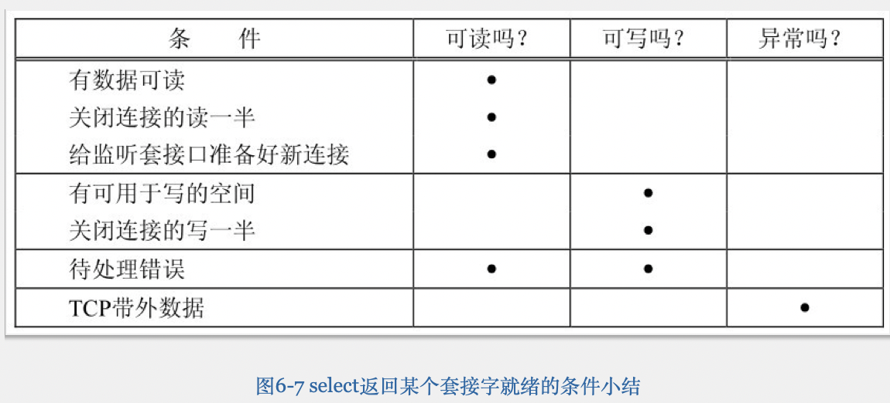

### 6.3.2 **select的最大描述符数**

早些时候我们说过，大多数应用程序不会用到许多描述符。譬如说我们很少能找到一个使用几百个描述符的应用程序。然而使用那么多描述符的应用程序确实存在，它们往往使用select来复选描述符。最初设计select时，操作系统通常对每个进程可用的最大描述符数设置了上限（4.2BSD的限制为31），select就使用相同的限制值。然而当今的Unix版本允许每个进程使用事实上无限数目的描述符（往往仅受限于内存总量和管理性限制），因此我们的问题是：这对select有什么影响？

许多实现有类似于下面的声明，它取自4.4BSD的<sys/types.h>头文件：

```cpp
/*

* select uses bitmasks of file descriptors in longs．These macros

* manipulate such bit fields (the filesystem macros use chars).

* FD_SETSIZE may be defined by the user, but the default here should

* be enough for most uses.

*/

#ifndef FD_SETSIZE

#define FD_SETSIZE 256

#endif
```

这使我们想到，可以在包括该头文件之前把FD_SETSIZE定义为某个更大的值以增加select所用描述符集的大小。

## 6.4 **str_cli函数**

现在我们可以使用select重写5.5节中的str_cli函数了，这样服务器进程一终止，客户就能马上得到通知。早先那个版本的问题在于：当套接字上发生某些事件时，客户可能阻塞于fgets调用。新版本改为阻塞于select调用，或是等待标准输入可读，或是等待套接字可读。图6-8展示了调用select所处理的各种条件。

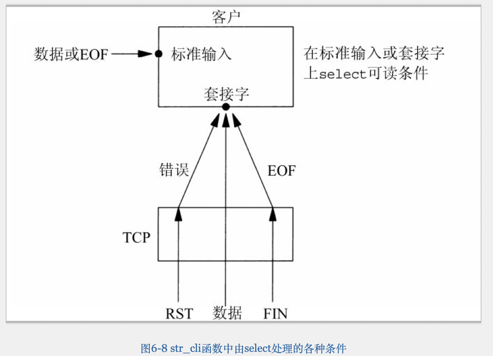

客户的套接字上的三个条件处理如下。

(1) 如果对端TCP发送数据，那么该套接字变为可读，并且read返回一个大于0的值（即读入数据的字节数）。

(2) 如果对端TCP发送一个FIN（对端进程终止），那么该套接字变为可读，并且read返回0（EOF）。

(3) 如果对端TCP发送一个RST（对端主机崩溃并重新启动），那么该套接字变为可读，并且read返回-1，而errno中含有确切的错误码。

图6-9给出了这个新版本的源代码。

**调用select**

8～13 我们只需要一个用于检查可读性的描述符集。该集合由FD_ZERO初始化，并用FD_SET打开两位：一位对应于标准I/O文件指针fp，一位对应于套接字sockfd。fileno函数把标准I/O文件指针转换为对应的描述符。select（和poll）只工作在描述符上。

计算出两个描述符中的较大值后，调用select。在该调用中，写集合指针和异常集合指针都是空指针。最后一个参数（时间限制）也是空指针，因为我们希望本调用阻塞到某个描述符就绪为止。

**处理可读套接字**

14～18 如果在select返回时套接字是可读的，那就先用readline读入回射文本行，再用fputs输出它。

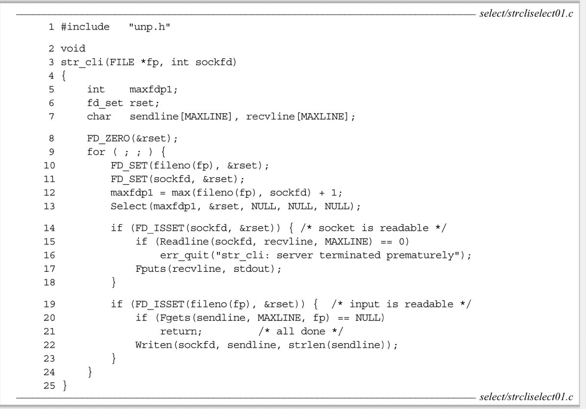

**处理可读输入**

19～23 如果标准输入可读，那就先用fgets读入一行文本，再用writen把它写到套接字中。

请注意，这个版本使用了与5.5节的版本相同的四个I/O函数：fgets、writen、readline和fputs，不过它们在本函数中的驱动流发生了变化。新的版本是由select调用来驱动的，而旧的版本则是由fgets调用来驱动的。与图5-5相比，图6-9中的代码仅增加了几行，就大大提高了客户程序的健壮性。

## 6.9 pselect函数

```c
#include <sys/select.h>
#include <signal.h>
#include <time.h>
int pselect(int maxfdp1, fd_set *readset, fd_set *writeset, fd_set *exceptset,
const struct timespec *timeout, const sigset_t *sigmask);
```

pselect相对于通常的select有两个变化。

(1) pselect使用timespec结构，而不使用timeval结构。timespec结构是POSIX的又一个发明。

struct timespec {

time_t tv_sec;　　　 /* seconds */

long　 tv_nsec;　　　/* nanoseconds */

};

这两个结构的区别在于第二个成员：新结构的该成员tv_nsec指定纳秒数，而旧结构的该成员tv_usec指定微秒数。

(2) pselect函数增加了第六个参数：一个指向信号掩码的指针。该参数允许程序先禁止递交某些信号，再测试由这些当前被禁止信号的信号处理函数设置的全局变量，然后调用pselect，告诉它重新设置信号掩码。

关于第二点，考虑下面的例子（在APUE第308～309页讨论）。这个程序的SIGINT信号处理函数仅仅设置全局变量intr_flag并返回。如果我们的进程阻塞于select调用，那么从信号处理函数的返回将导致select返回EINTR错误。然而调用select时，代码看起来大体如下：

```
if (intr_flag)

handle_intr();　　　　　 /* handle the signal */

if ( (nready = select( …… )) < 0) {

if (errno == EINTR) {

if (intr_flag)

handle_intr();

}

……

}
```

## 6.10 **poll函数**

poll函数起源于SVR3，最初局限于流设备（第31章）。SVR4取消了这种限制，允许poll工作在任何描述符上。poll提供的功能与select类似，不过在处理流设备时，它能够提供额外的信息。

```cpp
#include <poll.h>

int poll(struct pollfd *fdarray, unsigned long nfds, int timeout);

返回：若有就绪描述符则为其数目，若超时则为0，若出错则为-1
```

第一个参数是指向一个结构数组第一个元素的指针。每个数组元素都是一个pollfd结构，用于指定测试某个给定描述符fd的条件。

```cpp
struct{
int fd; 
short　events;　　　/* events of interest on fd */
short　revents;　　 /* events that occurred on fd */
};
```

要测试的条件由events成员指定，函数在相应的revents成员中返回该描述符的状态。（每个描述符都有两个变量，一个为调用值，另一个为返回结果，从而避免使用值—结果参数。回想select函数的中间三个参数都是值—结果参数。）这两个成员中的每一个都由指定某个特定条件的一位或多位构成。图6-23列出了用于指定events标志以及测试revents标志的一些常值。

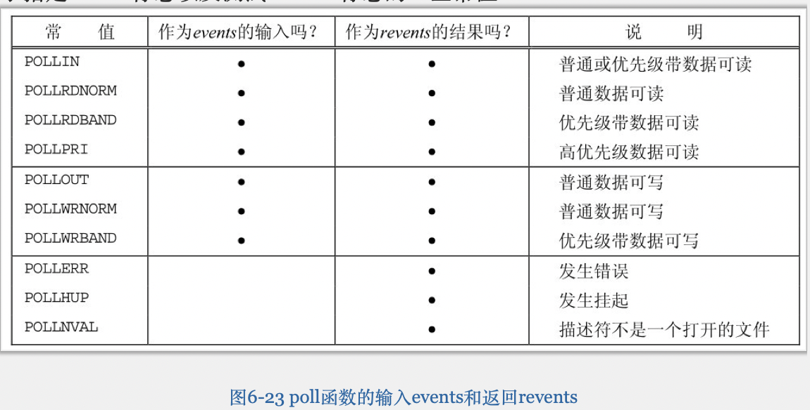

我们将该图分为三个部分：第一部分是处理输入的四个常值，第二部分是处理输出的三个常值，第三部分是处理错误的三个常值。其中第三部分的三个常值不能在events中设置，但是当相应条件存在时就在revents中返回。

poll识别三类数据：普通（normal）、优先级带（priority band）和高优先级（high priority）。这些术语均出自基于流的实现（图31-5）。

就TCP和UDP套接字而言，以下条件引起poll返回特定的revent。不幸的是，POSIX在其poll的定义中留了许多空洞（也就是说有多种方法可返回相同的条件）。

所有正规TCP数据和所有UDP数据都被认为是普通数据。

TCP的带外数据（第24章）被认为是优先级带数据。

当TCP连接的读半部关闭时（譬如收到了一个来自对端的FIN），也被认为是普通数据，随后的读操作将返回0。

TCP连接存在错误既可认为是普通数据，也可认为是错误（POLLERR）。无论哪种情况，随后的读操作将返回-1，并把errno设置成合适的值。这可用于处理诸如接收到RST或发生超时等条件。

在监听套接字上有新的连接可用既可认为是普通数据，也可认为是优先级数据。大多数实现视之为普通数据。

非阻塞式connect的完成被认为是使相应套接字可写。

结构数组中元素的个数是由nfds参数指定。

timeout参数指定poll函数返回前等待多长时间。它是一个指定应等待毫秒数的正值。图6-24给出了它的可能取值。

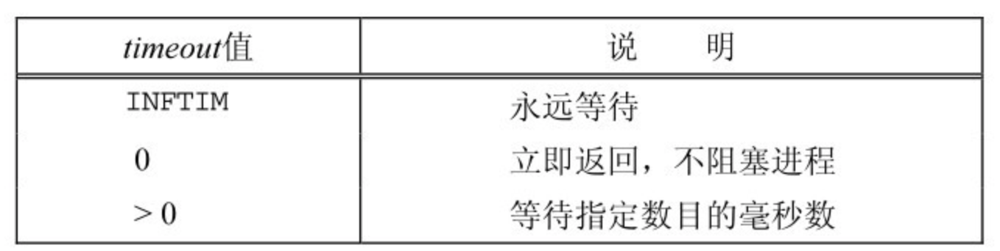

图6-24 poll的timeout参数值

INFTIM常值被定义为一个负值。如果系统不能提供毫秒级精度的定时器，该值就向上舍入到最接近的支持值。

POSIX规范要求在头文件<poll.h>中定义INFTIM，不过许多系统仍然把它定义在头文件<sys/stropts.h>中。

正如select，给poll指定的任何超时值都受限于实际系统实现的时钟分辨率（通常是10 ms）。

当发生错误时，poll函数的返回值为-1，若定时器到时之前没有任何描述符就绪，则返回0，否则返回就绪描述符的个数，即revents成员值非0的描述符个数。

如果我们不再关心某个特定描述符，那么可以把与它对应的pollfd结构的fd成员设置成一个负值。poll函数将忽略这样的pollfd结构的events成员，返回时将它的revents成员的值置为0。

回顾6.3节结尾处我们就FD_SETSIZE以及就每个描述符集中最大描述符数目相比每个进程中最大描述符数目展开的讨论。有了poll就不再有那样的问题了，因为分配一个pollfd结构的数组并把该数组中元素的数目通知内核成了调用者的责任。内核不再需要知道类似fd_set的固定大小的数据类型。

## 6.11 总结

**Select vs poll vs epoll**

https://static.app.yinxiang.com/embedded-web/profile/#/join?guid=32c471ab-5748-4120-b96e-caf90f74cc57&channel=copylink&shardId=s61&ownerId=21811079

### select

```
int select (int n, fd_set *readfds, fd_set *writefds, fd_set *exceptfds, struct timeval *timeout);
```

select 函数监视的文件描述符分3类，分别是writefds、readfds、和exceptfds。调用后select函数会阻塞，直到有描述副就绪（有数据 可读、可写、或者有except），或者超时（timeout指定等待时间，如果立即返回设为null即可），函数返回。当select函数返回后，可以通过遍历fdset，来找到就绪的描述符。

select目前几乎在所有的平台上支持，其良好跨平台支持也是它的一个优点。select的一 个缺点在于单个进程能够监视的文件描述符的数量存在最大限制，在Linux上一般为1024，可以通过修改宏定义甚至重新编译内核的方式提升这一限制，但 是这样也会造成效率的降低。

### poll

```
int poll (struct pollfd *fds, unsigned int nfds, int timeout);
```

不同与select使用三个位图来表示三个fdset的方式，poll使用一个 pollfd的指针实现。

```
struct pollfd {
    int fd; /* file descriptor */
    short events; /* requested events to watch */
    short revents; /* returned events witnessed */
};
```

pollfd结构包含了要监视的event和发生的event，不再使用select“参数-值”传递的方式。同时，pollfd并没有最大数量限制（但是数量过大后性能也是会下降）。 和select函数一样，poll返回后，需要轮询pollfd来获取就绪的描述符。

> 从上面看，select和poll都需要在返回后，`通过遍历文件描述符来获取已经就绪的socket`。事实上，同时连接的大量客户端在一时刻可能只有很少的处于就绪状态，因此随着监视的描述符数量的增长，其效率也会线性下降。

### epoll

epoll是在2.6内核中提出的，是之前的select和poll的增强版本。相对于select和poll来说，epoll更加灵活，没有描述符限制。epoll使用一个文件描述符管理多个描述符，将用户关系的文件描述符的事件存放到内核的一个事件表中，这样在用户空间和内核空间的copy只需一次。

#### epoll操作过程

epoll操作过程需要三个接口，分别如下：

```c
int epoll_create(int size)；//创建一个epoll的句柄，size用来告诉内核这个监听的数目一共有多大
int epoll_ctl(int epfd, int op, int fd, struct epoll_event *event)；
int epoll_wait(int epfd, struct epoll_event * events, int maxevents, int timeout);
```

**1. int epoll_create(int size);**
创建一个epoll的句柄，size用来告诉内核这个监听的数目一共有多大，这个参数不同于select()中的第一个参数，给出最大监听的fd+1的值，`参数size并不是限制了epoll所能监听的描述符最大个数，只是对内核初始分配内部数据结构的一个建议`。
当创建好epoll句柄后，它就会占用一个fd值，在linux下如果查看/proc/进程id/fd/，是能够看到这个fd的，所以在使用完epoll后，必须调用close()关闭，否则可能导致fd被耗尽。

**2. int epoll_ctl(int epfd, int op, int fd, struct epoll_event \*event)；**
函数是对指定描述符fd执行op操作。
\- epfd：是epoll_create()的返回值。
\- op：表示op操作，用三个宏来表示：添加EPOLL_CTL_ADD，删除EPOLL_CTL_DEL，修改EPOLL_CTL_MOD。分别添加、删除和修改对fd的监听事件。
\- fd：是需要监听的fd（文件描述符）
\- epoll_event：是告诉内核需要监听什么事，struct epoll_event结构如下：

```c
struct epoll_event {
  __uint32_t events;  /* Epoll events */
  epoll_data_t data;  /* User data variable */
};

//events可以是以下几个宏的集合：
EPOLLIN ：表示对应的文件描述符可以读（包括对端SOCKET正常关闭）；
EPOLLOUT：表示对应的文件描述符可以写；
EPOLLPRI：表示对应的文件描述符有紧急的数据可读（这里应该表示有带外数据到来）；
EPOLLERR：表示对应的文件描述符发生错误；
EPOLLHUP：表示对应的文件描述符被挂断；
EPOLLET： 将EPOLL设为边缘触发(Edge Triggered)模式，这是相对于水平触发(Level Triggered)来说的。
EPOLLONESHOT：只监听一次事件，当监听完这次事件之后，如果还需要继续监听这个socket的话，需要再次把这个socket加入到EPOLL队列里
```

**3. int epoll_wait(int epfd, struct epoll_event \* events, int maxevents, int timeout);**
等待epfd上的io事件，最多返回maxevents个事件。
参数events用来从内核得到事件的集合，maxevents告之内核这个events有多大，这个maxevents的值不能大于创建epoll_create()时的size，参数timeout是超时时间（毫秒，0会立即返回，-1将不确定，也有说法说是永久阻塞）。该函数返回需要处理的事件数目，如返回0表示已超时。

#### 工作模式

　epoll对文件描述符的操作有两种模式：**LT（level trigger）**和**ET（edge trigger）**。LT模式是默认模式，LT模式与ET模式的区别如下：
　　**LT模式**：当epoll_wait检测到描述符事件发生并将此事件通知应用程序，`应用程序可以不立即处理该事件`。下次调用epoll_wait时，会再次响应应用程序并通知此事件。
　　**ET模式**：当epoll_wait检测到描述符事件发生并将此事件通知应用程序，`应用程序必须立即处理该事件`。如果不处理，下次调用epoll_wait时，不会再次响应应用程序并通知此事件。

1. LT模式

LT(level triggered)是缺省的工作方式，并且同时支持block和no-block socket.在这种做法中，内核告诉你一个文件描述符是否就绪了，然后你可以对这个就绪的fd进行IO操作。如果你不作任何操作，内核还是会继续通知你的。

2. ET模式

ET(edge-triggered)是高速工作方式，只支持no-block socket。在这种模式下，当描述符从未就绪变为就绪时，内核通过epoll告诉你。然后它会假设你知道文件描述符已经就绪，并且不会再为那个文件描述符发送更多的就绪通知，直到你做了某些操作导致那个文件描述符不再为就绪状态了(比如，你在发送，接收或者接收请求，或者发送接收的数据少于一定量时导致了一个EWOULDBLOCK 错误）。但是请注意，如果一直不对这个fd作IO操作(从而导致它再次变成未就绪)，内核不会发送更多的通知(only once)

ET模式在很大程度上减少了epoll事件被重复触发的次数，因此效率要比LT模式高。epoll工作在ET模式的时候，必须使用非阻塞套接口，以避免由于一个文件句柄的阻塞读/阻塞写操作把处理多个文件描述符的任务饿死。

3. 总结

**假如有这样一个例子：**

1. 我们已经把一个用来从管道中读取数据的文件句柄(RFD)添加到epoll描述符
2. 这个时候从管道的另一端被写入了2KB的数据
3. 调用epoll_wait(2)，并且它会返回RFD，说明它已经准备好读取操作
4. 然后我们读取了1KB的数据
5. 调用epoll_wait(2)......

**LT模式：**
如果是LT模式，那么在第5步调用epoll_wait(2)之后，仍然能受到通知。

**ET模式：**
如果我们在第1步将RFD添加到epoll描述符的时候使用了EPOLLET标志，那么在第5步调用epoll_wait(2)之后将有可能会挂起，因为剩余的数据还存在于文件的输入缓冲区内，而且数据发出端还在等待一个针对已经发出数据的反馈信息。只有在监视的文件句柄上发生了某个事件的时候 ET 工作模式才会汇报事件。因此在第5步的时候，调用者可能会放弃等待仍在存在于文件输入缓冲区内的剩余数据。

当使用epoll的ET模型来工作时，当产生了一个EPOLLIN事件后，
读数据的时候需要考虑的是当recv()返回的大小如果等于请求的大小，那么很有可能是缓冲区还有数据未读完，也意味着该次事件还没有处理完，所以还需要再次读取：

```
while(rs){
  buflen = recv(activeevents[i].data.fd, buf, sizeof(buf), 0);
  if(buflen < 0){
    // 由于是非阻塞的模式,所以当errno为EAGAIN时,表示当前缓冲区已无数据可读
    // 在这里就当作是该次事件已处理处.
    if(errno == EAGAIN){
        break;
    }
    else{
        return;
    }
  }
  else if(buflen == 0){
     // 这里表示对端的socket已正常关闭.
  }

 if(buflen == sizeof(buf){
      rs = 1;   // 需要再次读取
 }
 else{
      rs = 0;
 }
}
```

> **Linux中的EAGAIN含义**

Linux环境下开发经常会碰到很多错误(设置errno)，其中EAGAIN是其中比较常见的一个错误(比如用在非阻塞操作中)。
从字面上来看，是提示再试一次。这个错误经常出现在当应用程序进行一些非阻塞(non-blocking)操作(对文件或socket)的时候。

例如，以 O_NONBLOCK的标志打开文件/socket/FIFO，如果你连续做read操作而没有数据可读。此时程序不会阻塞起来等待数据准备就绪返回，read函数会返回一个错误EAGAIN，提示你的应用程序现在没有数据可读请稍后再试。
又例如，当一个系统调用(比如fork)因为没有足够的资源(比如虚拟内存)而执行失败，返回EAGAIN提示其再调用一次(也许下次就能成功)。

#### 代码演示

下面是一段不完整的代码且格式不对，意在表述上面的过程，去掉了一些模板代码。

```c
#define IPADDRESS   "127.0.0.1"
#define PORT        8787
#define MAXSIZE     1024
#define LISTENQ     5
#define FDSIZE      1000
#define EPOLLEVENTS 100

listenfd = socket_bind(IPADDRESS,PORT);

struct epoll_event events[EPOLLEVENTS];

//创建一个描述符
epollfd = epoll_create(FDSIZE);

//添加监听描述符事件
add_event(epollfd,listenfd,EPOLLIN);

//循环等待
for ( ; ; ){
    //该函数返回已经准备好的描述符事件数目
    ret = epoll_wait(epollfd,events,EPOLLEVENTS,-1);
    //处理接收到的连接
    handle_events(epollfd,events,ret,listenfd,buf);
}

//事件处理函数
static void handle_events(int epollfd,struct epoll_event *events,int num,int listenfd,char *buf)
{
     int i;
     int fd;
     //进行遍历;这里只要遍历已经准备好的io事件。num并不是当初epoll_create时的FDSIZE。
     for (i = 0;i < num;i++)
     {
         fd = events[i].data.fd;
        //根据描述符的类型和事件类型进行处理
         if ((fd == listenfd) &&(events[i].events & EPOLLIN))
            handle_accpet(epollfd,listenfd);
         else if (events[i].events & EPOLLIN)
            do_read(epollfd,fd,buf);
         else if (events[i].events & EPOLLOUT)
            do_write(epollfd,fd,buf);
     }
}

//添加事件
static void add_event(int epollfd,int fd,int state){
    struct epoll_event ev;
    ev.events = state;
    ev.data.fd = fd;
    epoll_ctl(epollfd,EPOLL_CTL_ADD,fd,&ev);
}

//处理接收到的连接
static void handle_accpet(int epollfd,int listenfd){
     int clifd;     
     struct sockaddr_in cliaddr;     
     socklen_t  cliaddrlen;     
     clifd = accept(listenfd,(struct sockaddr*)&cliaddr,&cliaddrlen);     
     if (clifd == -1)         
     perror("accpet error:");     
     else {         
         printf("accept a new client: %s:%d\n",inet_ntoa(cliaddr.sin_addr),cliaddr.sin_port);                       //添加一个客户描述符和事件         
         add_event(epollfd,clifd,EPOLLIN);     
     } 
}

//读处理
static void do_read(int epollfd,int fd,char *buf){
    int nread;
    nread = read(fd,buf,MAXSIZE);
    if (nread == -1)     {         
        perror("read error:");         
        close(fd); //记住close fd        
        delete_event(epollfd,fd,EPOLLIN); //删除监听 
    }
    else if (nread == 0)     {         
        fprintf(stderr,"client close.\n");
        close(fd); //记住close fd       
        delete_event(epollfd,fd,EPOLLIN); //删除监听 
    }     
    else {         
        printf("read message is : %s",buf);        
        //修改描述符对应的事件，由读改为写         
        modify_event(epollfd,fd,EPOLLOUT);     
    } 
}

//写处理
static void do_write(int epollfd,int fd,char *buf) {     
    int nwrite;     
    nwrite = write(fd,buf,strlen(buf));     
    if (nwrite == -1){         
        perror("write error:");        
        close(fd);   //记住close fd       
        delete_event(epollfd,fd,EPOLLOUT);  //删除监听    
    }else{
        modify_event(epollfd,fd,EPOLLIN); 
    }    
    memset(buf,0,MAXSIZE); 
}

//删除事件
static void delete_event(int epollfd,int fd,int state) {
    struct epoll_event ev;
    ev.events = state;
    ev.data.fd = fd;
    epoll_ctl(epollfd,EPOLL_CTL_DEL,fd,&ev);
}

//修改事件
static void modify_event(int epollfd,int fd,int state){     
    struct epoll_event ev;
    ev.events = state;
    ev.data.fd = fd;
    epoll_ctl(epollfd,EPOLL_CTL_MOD,fd,&ev);
}

//注：另外一端我就省了
```

#### epoll总结

在 select/poll中，进程只有在调用一定的方法后，内核才对所有监视的文件描述符进行扫描，而**epoll事先通过epoll_ctl()来注册一 个文件描述符，一旦基于某个文件描述符就绪时，内核会采用类似callback的回调机制，迅速激活这个文件描述符，当进程调用epoll_wait() 时便得到通知**。(`此处去掉了遍历文件描述符，而是通过监听回调的的机制`。这正是epoll的魅力所在。)

**epoll的优点主要是一下几个方面：**

1. 监视的描述符数量不受限制，它所支持的FD上限是最大可以打开文件的数目，这个数字一般远大于2048,举个例子,在1GB内存的机器上大约是10万左 右，具体数目可以cat /proc/sys/fs/file-max察看,一般来说这个数目和系统内存关系很大。select的最大缺点就是进程打开的fd是有数量限制的。这对 于连接数量比较大的服务器来说根本不能满足。虽然也可以选择多进程的解决方案( Apache就是这样实现的)，不过虽然linux上面创建进程的代价比较小，但仍旧是不可忽视的，加上进程间数据同步远比不上线程间同步的高效，所以也不是一种完美的方案。
2. IO的效率不会随着监视fd的数量的增长而下降。epoll不同于select和poll轮询的方式，而是通过每个fd定义的回调函数来实现的。只有就绪的fd才会执行回调函数。

> 如果没有大量的idle -connection或者dead-connection，epoll的效率并不会比select/poll高很多，但是当遇到大量的idle- connection，就会发现epoll的效率大大高于select/poll。

参考：https://segmentfault.com/a/1190000003063859

# 16. **非阻塞式I/O**

## 16.1 概述

套接字的默认状态是阻塞的。这就意味着当发出一个不能立即完成的套接字调用时，其进程将被投入睡眠，等待相应操作完成。可能阻塞的套接字调用可分为以下四类。

(1) 输入操作，包括read、readv、recv、recvfrom和recvmsg共5个函数。如果某个进程对一个阻塞的TCP套接字（默认设置）调用这些输入函数之一，而且该套接字的接收缓冲区中没有数据可读，该进程将被投入睡眠，直到有一些数据到达。既然TCP是字节流协议，该进程的唤醒就是只要有一些数据到达，这些数据既可能是单个字节，也可以是一个完整的TCP分节中的数据。如果想等到某个固定数目的数据可读为止，那么可以调用我们的readn函数（图3-15），或者指定MSG_WAITALL标志（图14-6）。

既然UDP是数据报协议，如果一个阻塞的UDP套接字的接收缓冲区为空，对它调用输入函数的进程将被投入睡眠，直到有UDP数据报到达。

对于非阻塞的套接字，如果输入操作不能被满足（对于TCP套接字即至少有一个字节的数据可读，对于UDP套接字即有一个完整的数据报可读），相应调用将立即返回一个EWOULDBLOCK错误。

(2) 输出操作，包括write、writev、send、sendto和sendmsg共5个函数。对于一个TCP套接字我们已在2.11节说过，内核将从应用进程的缓冲区到该套接字的发送缓冲区复制数据。对于阻塞的套接字，如果其发送缓冲区中没有空间，进程将被投入睡眠，直到有空间为止。

对于一个非阻塞的TCP套接字，如果其发送缓冲区中根本没有空间，输出函数调用将立即返回一个EWOULDBLOCK错误。如果其发送缓冲区中有一些空间，返回值将是内核能够复制到该缓冲区中的字节数。这个字节数也称为不足计数（short count）。

我们还在2.11节说过，UDP套接字不存在真正的发送缓冲区。内核只是复制应用进程数据并把它沿协议栈向下传送，渐次冠以UDP首部和IP首部。因此对一个阻塞的UDP套接字（默认设置），输出函数调用将不会因与TCP套接字一样的原因而阻塞，不过有可能会因其他的原因而阻塞。

我们还在2.11节说过，UDP套接字不存在真正的发送缓冲区。内核只是复制应用进程数据并把它沿协议栈向下传送，渐次冠以UDP首部和IP首部。因此对一个阻塞的UDP套接字（默认设置），输出函数调用将不会因与TCP套接字一样的原因而阻塞，不过有可能会因其他的原因而阻塞。

(3) 接受外来连接，即accept函数。如果对一个阻塞的套接字调用accept函数，并且尚无新的连接到达，调用进程将被投入睡眠。

如果对一个非阻塞的套接字调用accept函数，并且尚无新的连接到达，accept调用将立即返回一个EWOULDBLOCK错误。

(4) 发起外出连接，即用于TCP的connect函数。（回顾一下，我们知道connect同样可用于UDP，不过它不能使一个“真正”的连接建立起来，它只是使内核保存对端的IP地址和端口号。）我们已在2.6节展示过，TCP连接的建立涉及一个三路握手过程，而且connect函数一直要等到客户收到对于自己的SYN的ACK为止才返回。这意味着TCP的每个connect总会阻塞其调用进程至少一个到服务器的RTT时间。

如果对一个非阻塞的TCP套接字调用connect，并且连接不能立即建立，那么连接的建立能照样发起（譬如送出TCP三路握手的第一个分组），不过会返回一个EINPROGRESS错误。注意这个错误不同于上述三个情形中返回的错误。另请注意有些连接可以立即建立，通常发生在服务器和客户处于同一个主机的情况下。因此即使对于一个非阻塞的connect，我们也得预备connect成功返回的情况发生。我们将在16.3节展示一个非阻塞connect的例子。

按照传统，对于不能被满足的非阻塞式I/O操作，System V会返回EAGAIN错误，而源自Berkeley的实现则返回EWOULDBLOCK错误。顾及历史原因，POSIX规范声称这种情况下这两个错误码都可以返回。幸运的是，大多数当前的系统把这两个错误码定义成相同的值（检查一下你自己的系统中的<sys/errno.h>头文件），因此具体使用哪一个并无多大关系。我们在本书中使用EWOULDBLOCK。

6.2节汇总了I/O的各种可用模型，并比较了非阻塞式I/O和其他模型。在本章中，我们将提供上述所有四类操作的非阻塞式I/O例子，并开发一个类似Web客户程序的新型客户程序，它使用非阻塞connect同时发起多个TCP连接。

## **16.2 非阻塞读和写：str_cli函数（修订版）**

我们再次回到在5.5节和6.4节讨论过的str_cli函数。6.4节讲过的使用了select的版本仍使用阻塞式I/O。举例来说，如果在标准输入有一行文本可读，我们就调用read读入它，再调用writen把它发送给服务器。然而如果套接字发送缓冲区已满，writen调用将会阻塞。在进程阻塞于writen调用期间，可能有来自套接字接收缓冲区的数据可供读取。类似地，如果从套接字中有一行输入文本可读，那么一旦标准输出比网络还要慢，进程照样可能阻塞于后续的write调用。本节的目标是开发这个函数的一个使用非阻塞式I/O的版本。这样可以防止进程在可做任何有效工作期间发生阻塞。

不幸的是，非阻塞式I/O的加入让本函数的缓冲区管理显著地复杂化了，因此我们将分片介绍这个函数。我们已在第6章和第14章中讨论过在套接字上使用标准I/O的潜在问题和困难，它们在非阻塞式I/O操作中显得尤为突出。本例子中继续避免使用标准I/O。

我们维护着两个缓冲区：to容纳从标准输入到服务器去的数据，fr容纳自服务器到标准输出来的数据。图16-1展示了to缓冲区的组织和指向该缓冲区中的指针。

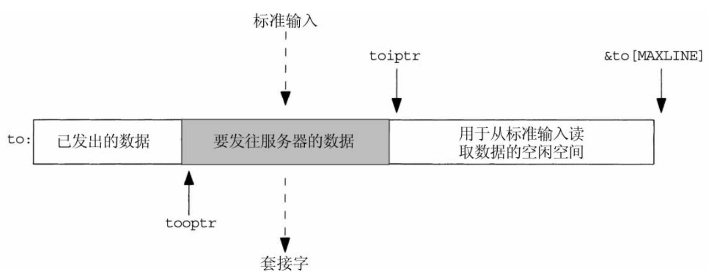

图16-1 容纳从标准输入到套接字的数据的缓冲区

其中toiptr指针指向从标准输入读入的数据可以存放的下一个字节。tooptr指向下一个必须写到套接字的字节。有（toiptr -tooptr）个字节需写到套接字。可从标准输入读入的字节数是（&to［MAXLINE］- toiptr）。一旦tooptr移动到toiptr，这两个指针就一起恢复到缓冲区开始处。

图16-2展示了fr缓冲区相应的组织。

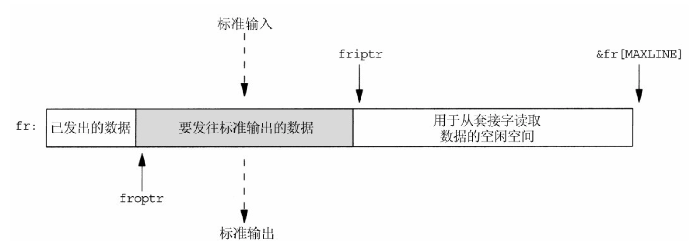

图16-2 容纳从套接字到标准输出的数据的缓冲区

图16-3给出了本函数的第一部分。

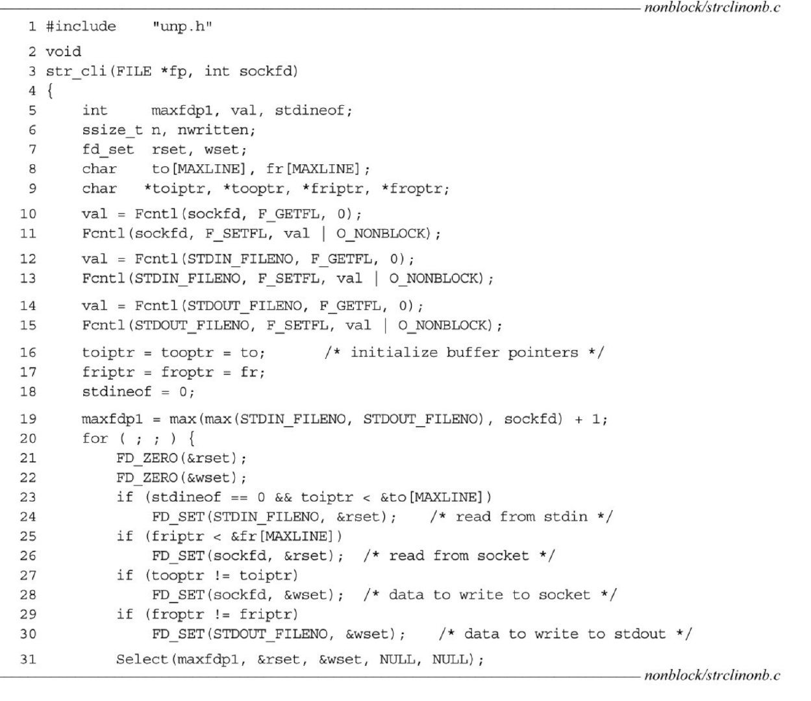

**把描述符设置为非阻塞**

10～15 使用fcntl把所用3个描述符都设置为非阻塞，包括连接到服务器的套接字、标准输入和标准输出。

**初始化缓冲区指针**

16～19 初始化指向两个缓冲区的指针，并把最大的描述符号加1，以用作select的第一个参数。

**主循环：准备调用select**

20 和本函数在图6-13中给出的版本一样，这个版本的主循环也是一个select调用后跟对所关注各个条件所进行的单独测试。

**指定所关注的描述符**

21～30 两个描述符集都先清零再打开最多2位。如果在标准输入上尚未读到EOF，而且在to缓冲区中有至少一个字节的可用空间，那就打开读描述符集中对应标准输入的位。如果在fr缓冲区中有至少一个字节的可用空间，那就打开读描述符集中对应套接字的位。如果在to缓冲区中有要写到套接字的数据，那就打开写描述符集中对应套接字的位。最后，如果在fr缓冲区中有要写到标准输出的数据，那就打开写描述符集中对应标准输出的位。

**调用select**

31 调用select，等待4个可能条件中任何一个变为真。我们没有为本select调用设置超时。

str_cli函数的下一部分在图16-4中给出。本部分代码包含select返回后执行的4个测试中的前2个。

**从标准输入read**

32～33 如果标准输入可读，那就调用read。指定的第三个参数是to缓冲区中的可用空间量。

**处理非阻塞错误**

34～35 如果发生一个EWOULDBLOCK错误，我们就忽略它。通常情况下这种条件“不应该发生”，因为这种条件意味着，select告知我们相应描述符可读，然而read该描述符却返回EWOULDBLOCK错误，不过我们无论如何还是处理这种条件。

**read返回EOF**

36～40 如果read返回0，那么标准输入处理就此结束，我们还设置stdineof标志。如果在to缓冲区中不再有数据要发送（即tooptr等于toiptr），那就调用shutdown发送FIN到服务器。如果在to缓冲区中仍有数据要发送，FIN的发送就得推迟到缓冲区中数据已写到套接字之后。

36～40 如果read返回0，那么标准输入处理就此结束，我们还设置stdineof标志。如果在to缓冲区中不再有数据要发送（即tooptr等于toiptr），那就调用shutdown发送FIN到服务器。如果在to缓冲区中仍有数据要发送，FIN的发送就得推迟到缓冲区中数据已写到套接字之后。

我们输出一行文本到标准错误输出以表示这个EOF，同时输出当前时间。本输出信息的用途会在讲解完本函数之后展示。类似的fprintf在本函数中还多处出现。

**read返回数据**

41～45 当read返回数据时，我们相应地增加toiptr。我们还打开写描述符集中与套接字对应的位，使得以后在本循环内对该位的测试为真，从而导致调用write写到套接字。

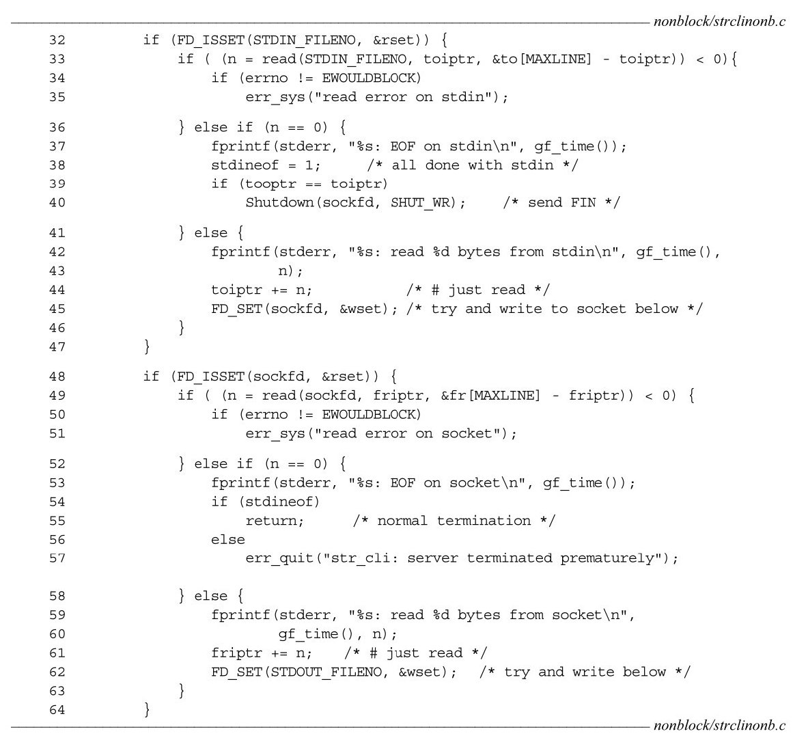

这是编写代码时需要做出的艰难抉择之一。这里有若干个手段可供选择。我们可以什么都不做，不用在写集合中设置位，这种情况下select将在下次被调用时测试套接字的可写性。然而这个无为手段要求在已知有数据要写到套接字的情况下，再次进入另一轮循环以调用select。另一个手段是将用于写到套接字的代码复制至此。然而这个手段不仅看似浪费，而且是一个潜在的犯错根源（万一被复制的代码中存在某个缺陷，而我们只在其中某个位置修复了该缺陷，却忘了另一个位置）。再一个手段是创建一个写到套接字的函数，并以调用该函数取代代码复制。然而这个手段要求该函数共享str_cli的3个局部变量，有可能使得这些变量成为全局变量。在这里所作出的选择是作者自认为最好的。

**从套接字read**

48～64 这段代码类似于刚才讲解的处理标准输入可读条件的if语句。如果read返回EWOULDBLOCK错误，那么不做任何处理。如果遇到来自服务器的EOF，那么若我们已经在标准输入上遇到EOF则没有问题，否则来自服务器的EOF并非预期。如果read返回一些数据，我们就相应地增加friptr，并把写描述符集中与标准输出对应的位打开，以尝试在本函数第三部分中将这些数据写出到标准输出。

图16-5给出了本函数的最后一部分。

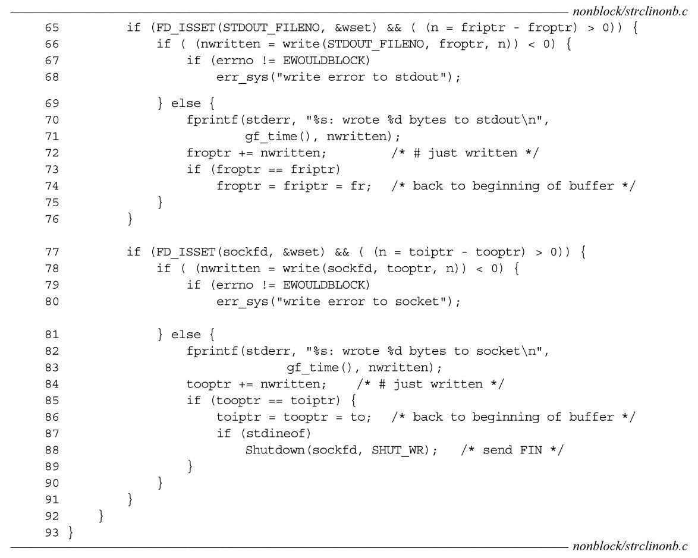

## **16.3 非阻塞connect**

当在一个非阻塞的TCP套接字上调用connect时，connect将立即返回一个EINPROGRESS错误，不过已经发起的TCP三路握手继续进行。我们接着使用select检测这个连接或成功或失败的已建立条件。非阻塞的connect有三个用途。

(1) 我们可以把三路握手叠加在其他处理上。完成一个connect要花一个RTT时间（2.5节），而RTT波动范围很大，从局域网上的几个毫秒到几百个毫秒甚至是广域网上的几秒。这段时间内也许有我们想要执行的其他处理工作可执行。

(2) 我们可以使用这个技术同时建立多个连接。这个用途已随着Web浏览器变得流行起来，我们将在16.5节给出这样的一个例子。

(3) 既然使用select等待连接的建立，我们可以给select指定一个时间限制，使得我们能够缩短connect的超时。许多实现有着从75秒钟到数分钟的connect超时时间。应用程序有时想要一个更短的超时时间，实现方法之一就是使用非阻塞connect。我们已在14.2节讨论过在套接字操作上设置超时时间的其他方法。

(3) 既然使用select等待连接的建立，我们可以给select指定一个时间限制，使得我们能够缩短connect的超时。许多实现有着从75秒钟到数分钟的connect超时时间。应用程序有时想要一个更短的超时时间，实现方法之一就是使用非阻塞connect。我们已在14.2节讨论过在套接字操作上设置超时时间的其他方法。

非阻塞connnct虽然听似简单，却有一些我们必须处理的细节。

尽管套接字是非阻塞的，如果连接到的服务器在同一个主机上，那么当我们调用connect时，连接通常立刻建立。我们必须处理这种情形。

源自Berkeley的实现（和POSIX）有关于select和非阻塞connect的以下两个规则：（1）当连接成功建立时，描述符变为可写（TCPv2第531页）；（2）当连接建立遇到错误时，描述符变为既可读又可写（TCPv2第530页）。

关于select的这两个规则出自6.3节中关于描述符就绪条件的相关规则。一个TCP套接字变为可写的条件是：其发送缓冲区中有可用空间（对于连接建立中的套接字而言本子条件总为真，因为尚未往其中写出任何数据），并且该套接字已建立连接（本子条件为真发生在三路握手完成之后）。一个TCP套接字上发生某个错误时，这个待处理错误总是导致该套接字变为既可读又可写。

在下面的例子中我们将提及有关非阻塞connect的许多移植性问题。

## **16.4 非阻塞connect：时间获取客户程序**

图16-11给出的connect_nonb函数执行一个非阻塞connect。我们把图1-5的connect调用替换成：

if (connect_nonb(sockfd, (SA*) &servaddr, sizeof(servaddr), 0) < 0)

err_sys("connect error");

它的前3个参数和connect的一样，第四个参数是等待连接完成的秒数。值为0暗指不给select设置超时；因此内核将使用通常的TCP连接建立超时。

**设置套接字为非阻塞**

9～10 调用fcntl把套接字设置为非阻塞。

11～14 发起非阻塞connect。期望的错误是EINPROGRESS，表示连接建立已经启动但是尚未完成（TCPv2第466页）。connect返回的任何其他错误返回给本函数的调用者。

**在其他处理上迭合连接建立**

15 至此我们可以在等待连接建立完成期间做任何我们想做的事情。

**检查连接是否立即建立**

16～17 如果非阻塞connect返回0，那么连接已经建立。我们已经说过，当服务器处于客户所在主机时这种情况可能发生。

**调用select**

18～24 调用select等待套接字变为可读或可写。我们清零rset，打开这个描述符集中对应sockfd的位，然后将rset复制到wset。复制描述符集的赋值可能是一个结构赋值，因为描述符集通常作为结构表示。我们还初始化timeval结构，然后调用select。如果调用者把第四个参数指定为0（表示使用默认超时时间），那么我们必须把select的最后一个参数指定为一个空指针，而不是一个值为0的timeval结构（后者意味着根本不等待）。

**处理超时**

25～28 如果select返回0，那么超时发生，我们于是返回ETIMEOUT错误给调用者。我们还要关闭套接字，以防止已经启动的三路握手继续下去。

**检查可读或可写条件**

29～34 如果描述符变为可读或可写，我们就调用getsockopt取得套接字的待处理错误（使用SO_ERROR套接字选项）。如果连接成功建立，该值将为0。如果连接建立发生错误，该值就是对应连接错误的errno值（譬如ECONNREFUSED、ETIMEDOUT等）。这里我们会遇到第一个移植性问题。如果发生错误，getsockopt源自Berkeley的实现将在我们的变量error中返回待处理错误，getsockopt本身返回0；然而Solaris却让getsockopt返回-1，并把errno变量置为待处理错误。不过我们的程序能够同时处理这两种情形。

**关闭非阻塞状态并返回**

36～42 恢复套接字的文件状态标志并返回。如果自getsockopt返回的error变量为非0值，我们就把该值存入errno，函数本身返回-1。

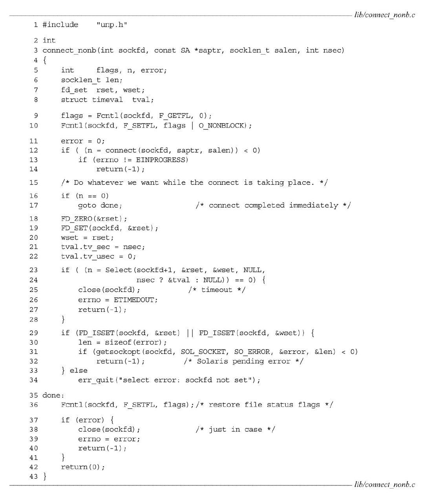

我们之前说过，套接字的各种实现以及非阻塞connect会带来移植性问题。首先，调用select之前有可能连接已经建立并有来自对端的数据到达。这种情况下即使套接字上不发生错误，套接字也是既可读又可写，这和连接建立失败情况下套接字的读写条件一样。图16-11中的代码通过调用getsockopt并检查套接字上是否存在待处理错误来处理这种情形。

其次，既然我们不能假设套接字的可写（而不可读）条件是select返回套接字操作成功条件的唯一方法，下一个移植性问题就是怎样判断连接建立是否成功。张贴到Usenet上的解决办法各式各样。这些方法可以取代图16-11中的getsockopt调用。

(1) 调用getpeername代替getsockopt。如果getpeername以ENOTCONN错误失败返回，那么连接建立已经失败，我们必须接着以SO_ERROR调用getsockopt取得套接字上待处理的错误。

(2) 以值为0的长度参数调用read。如果read失败，那么connect已经失败，read返回的errno给出了连接失败的原因。如果连接建立成功，那么read应该返回0。

(3) 再调用connect一次。它应该失败，如果错误是EISCONN，那么套接字已经连接，也就是说第一次连接已经成功。

不幸的是，非阻塞connect是网络编程中最不易移植的部分。使用该技术必须准备应付移植性问题，特别是对于较老的实现。避免移植性问题的一个较简单技术是为每个连接创建一个处理线程（第26章）。

**被中断的connect**

对于一个正常的阻塞式套接字，如果其上的connect调用在TCP三路握手完成前被中断（譬如说捕获了某个信号），将会发生什么呢？假设被中断的connect调用不由内核自动重启，那么它将返回EINTR。我们不能再次调用connect等待未完成的连接继续完成。这样做将导致返回EADDRINUSE错误。

这种情形下我们只能调用select，就像本节对于非阻塞connect所做的那样。连接建立成功时select返回套接字可写条件，连接建立失败时select返回套接字既可读又可写条件。

## **16.5 非阻塞connect：Web客户程序**


# 25. **信号驱动式I/O**

## **25.1 概述**

信号驱动式I/O是指进程预先告知内核，使得当某个描述符上发生某事时，内核使用信号通知相关进程。它在历史上曾被称为异步I/O（asynchronous I/O），不过我们讲解的信号驱动式I/O不是真正的异步I/O。后者通常定义为进程执行I/O系统调用（譬如读或写）告知内核启动某个I/O操作，内核启动I/O操作后立即返回到进程。进程在I/O操作发生期间继续执行。当操作完成或遇到错误时，内核以进程在I/O系统调用中指定的某种方式通知进程。我们已在6.2节比较了通常可用的各种I/O类型，并指出了信号驱动式I/O和异步I/O之间的差异。

注意，我们在第16章讲解过的非阻塞式I/O同样不是异步I/O。对于非阻塞式I/O，内核一旦启动I/O操作就不像异步I/O那样立即返回到进程，而是等到I/O操作完成或遇到错误；内核立即返回的唯一条件是I/O操作的完成不得不把进程投入睡眠，这种情况下内核不启动I/O操作。

POSIX通过aio_XXX函数提供真正的异步I/O。这些函数允许进程指定I/O操作完成时是否由内核产生信号以及产生什么信号。

源自Berkeley的实现使用SIGIO信号支持套接字和终端设备上的信号驱动式I/O。SVR4使用SIGPOLL信号支持流设备上的信号驱动式I/O，SIGPOLL因而等价于SIGIO。

## 25.2 **套接字的信号驱动式I/O**

针对一个套接字使用信号驱动式I/O（SIGIO）要求进程执行以下3个步骤。

(1) 建立SIGIO信号的信号处理函数。

(2) 设置该套接字的属主，通常使用fcntl的F_SETOWN命令设置（图7-20）。

(3) 开启该套接字的信号驱动式I/O，通常通过使用fcntl的F_SETFL命令打开O_ASYNC标志完成（图7-20）。

O_ASYNC标志是相对较晚加到POSIX规范中的。支持该标志的系统仍不多见。我们在图25-4中改用ioctl的FIOASYNC请求代为开启信号驱动式I/O。注意POSIX选用的名字并不恰当：选用O_SIGIO作为这个

标志的名字也许更好些。

我们应该在设置套接字属主之前建立信号处理函数。在源自Berkeley的实现中，这两个步骤的函数调用顺序无关紧要，因为SIGIO的默认行为是忽略该信号。要是我们颠倒这两个函数调用的顺序，那么在调用fcntl之后但在调用signal之前有较小的机会产生SIGIO信号；若真如此，该信号只是被丢弃。然而在SVR4中，头文件<sys/signal.h>把SIGIO定义为SIGPOLL，而SLGPOLL的默认行为是终止进程。因此在SVR4中，我们必须先安装信号处理函数，再设置套接字属主。

尽管很容易把一个套接字设置成以信号驱动式I/O模式工作，确定哪些条件导致内核产生递交给套接字属主的SIGIO信号却殊非易事。这种判定取决于支撑协议。

**25.2.1 对于UDP套接字的SIGIO信号**

在UDP上使用信号驱动式I/O是简单的。SIGIO信号在发生以下事件时产生：

数据报到达套接字；

套接字上发生异步错误。

因此当捕获对于某个UDP套接字的SIGIO信号时，我们调用recvfrom或者读入到达的数据报，或者获取发生的异步错误。我们已在8.9节就UDP套接字讨论过异步错误，从中知道发生异步错误的前提是UDP套接字已连接。

这两个条件下，SIGIO信号通过调用sorwakeup产生（见TCPv2第775、779页及784页）。

**25.2.2 对于TCP套接字的SIGIO信号**

不幸的是，信号驱动式I/O对于TCP套接字近乎无用。问题在于该信号产生得过于频繁，并且它的出现并没有告诉我们发生了什么事件。正如TCPv2第439页所注，下列条件均导致对于一个TCP套接字产生SIGIO信号（假设该套接字的信号驱动式I/O已经开启）：

监听套接字上某个连接请求已经完成；

某个断连请求已经发起；

某个断连请求已经完成；

某个连接之半已经关闭；

数据到达套接字；

数据已经从套接字发送走（即输出缓冲区有空闲空间）；

发生某个异步错误。

举例来说，如果一个进程既读自又写往一个TCP套接字，那么当有新数据到达时或者当以前写出的数据得到确认时，SIGIO信号均会产生，而且信号处理函数中无法区分这两种情况。如果SIGIO用于这种数据读写情形，那么TCP套接字应该设置成非阻塞式，以防read或write发生阻塞。我们应该考虑只对监听TCP套接字使用SIGIO，因为对于监听套接字产生SIGIO的唯一条件是某个新连接的完成。

作者能够找到的信号驱动式I/O对于套接字的唯一现实用途是基于UDP的NTP服务器程序。服务器主循环接收来自客户的一个请求数据报并发送回一个应答数据报。然而对于每个客户请求，其处理工作量并非可以忽略（远比我们简单地回射服务器多）。对服务器而言，重要的是为每个收取的数据报记录精确的时间戳，因为该值将返送给客户，由客户用于计算到服务器的RTT。图25-1展示了构建这样的UDP服务器的两种方式。

大多数UDP服务器（包括第8章中的回射服务器）都设计成图中左侧所示的方式，不过NTP服务器却采用右侧所示的技巧，当一个新的数据报到达时，SIGIO处理函数读入该数据报，同时记录它的到达时刻，然后将它置于进程内的另一个队列中，以便主服务器循环移走并处理。尽管这个技巧让服务器代码变复杂了，却为到达数据报提供了精确的时间戳。

回顾图22-4，我们知道进程可以通过设置IP_RECVDSTADDR套接字选项获取所收取UDP数据报的目的地址。可能有人会争论说，对于所收取UDP数据报应该同时返回另外两个信息，接收接口指示（如果主机采用普遍的弱端系统模型，那么接收接口和目的地址可能不一致）和数据报到达时刻。

对于IPv6，IPV6_PKTINFO套接字选项（22.8节）返回接收接口。对于IPv4，我们已在22.2节讨论过IP_RECVIF套接字选项。

FreeBSD还提供SO_TIMESTAMP套接字选项，它在一个timeval结构中以辅助数据的形式返回数据报的接收时刻。Linux则提供SIOCGSTAMP ioctl，它返回一个含有数据报接收时刻的timeval结构。

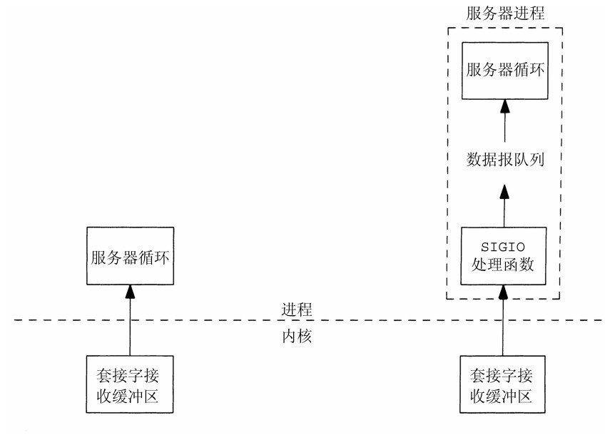

## **25.3 使用SIGIO的UDP回射服务器程序**

我们现在给出一个类似图25-1右侧的例子：一个使用SIGIO信号接收到达数据报的UDP服务器程序。

客户程序就是图8-7和图8-8，没有任何改动。服务器程序main函数与图8-3的一样。我们做的唯一修改是对dg_echo函数，将由接下来的4幅图共同给出。图25-2给出了全局声明。

**已收取数据报队列**

3～12 SIGIO信号处理函数把到达的数据报放入一个队列。该队列是一个DG结构数组，我们把它作为一个环形缓冲区处理。每个DG结构包括指向所收取数据报的一个指针、该数据报的长度、指向含有客户协议地址的某个套接字地址结构的一个指针、该协议地址的大小。静态分配QSIZE个DG结构，我们将在图25-4中看到，dg_echo函数调用malloc动态分配所有数据报和套接字地址结构的内存空3～12 SIGIO信号处理函数把到达的数据报放入一个队列。该队列是一个DG结构数组，我们把它作为一个环形缓冲区处理。每个DG结构包括指向所收取数据报的一个指针、该数据报的长度、指向含有客户协议地址的某个套接字地址结构的一个指针、该协议地址的大小。静态分配QSIZE个DG结构，我们将在图25-4中看到，dg_echo函数调用malloc动态分配所有数据报和套接字地址结构的内存空间。我们还分配一个稍后解释的诊断用计数器cntread。图25-3展示了这个DG结构数组，其中假设第一个元素指向一个150字节的数据报，与它关联的套接字地址结构长度为16。

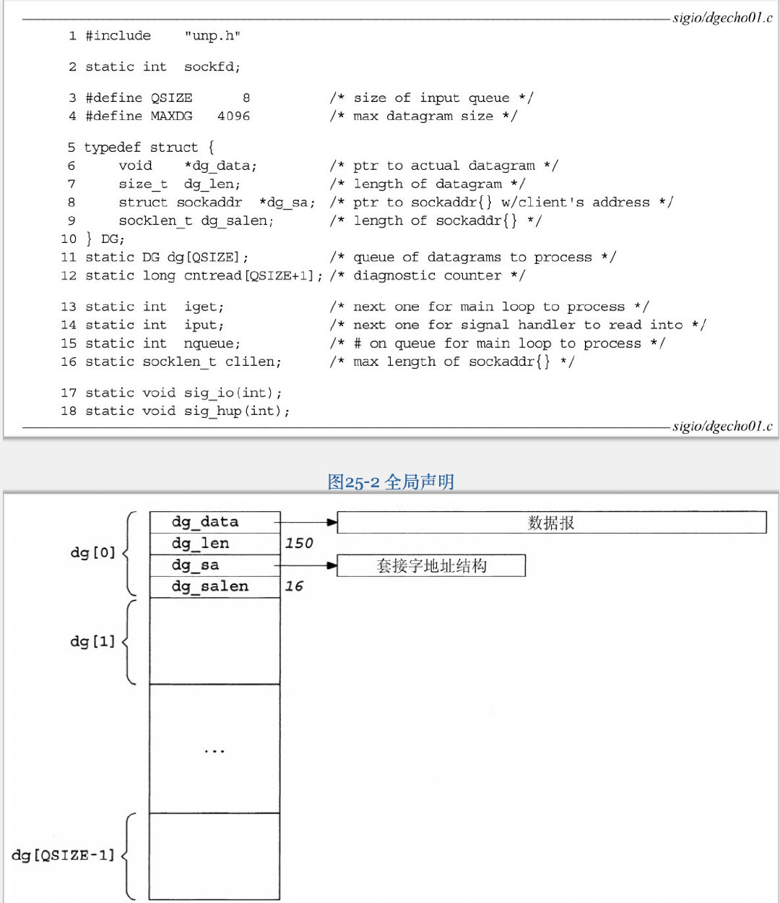

**数组下标**

13～15 iget是主循环将处理的下一个数组元素的下标，iput是信号处理函数将存放到的下一个数组元素的下标，nqueue是队列中供主循环处理的数据报的总数。

图25-4给出了主服务器循环，即dg_echo函数。

**初始化已接收数据报队列**

27～32 把套接字描述符保存在一个全局变量中，因为信号处理函数需要它。初始化已接收数据报队列。


## **25.4 小结**

信号驱动式I/O就是让内核在套接字上发生“某事”时使用SIGIO信号通知进程。

对于已连接TCP套接字，可以导致这种通知的条件为数众多，反而使得这个特性几近无用。

对于监听TCP套接字，这种通知发生在有一个新连接已准备好接受之时。

对于UDP套接字，这种通知意味着或者到达一个数据报，或者到达一个异步错误，这两种情况下我们都调用recvfrom。

我们把早先的UDP回射服务器程序改为使用信号驱动式I/O，所用技巧类似于NTP，尽快读入已到达的每个数据报以获取其到达时刻的精确时间戳，然后将它置于某个队列供后续处理。

# 26. 

