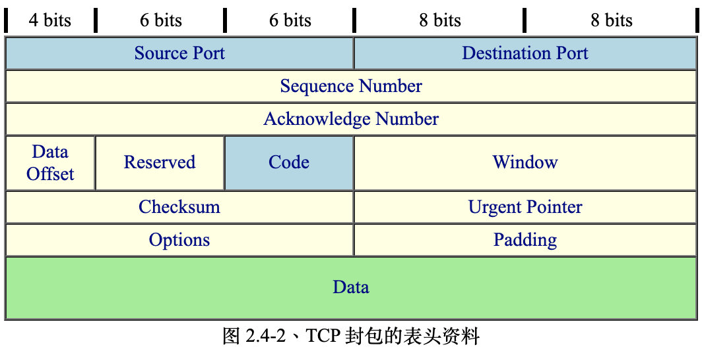
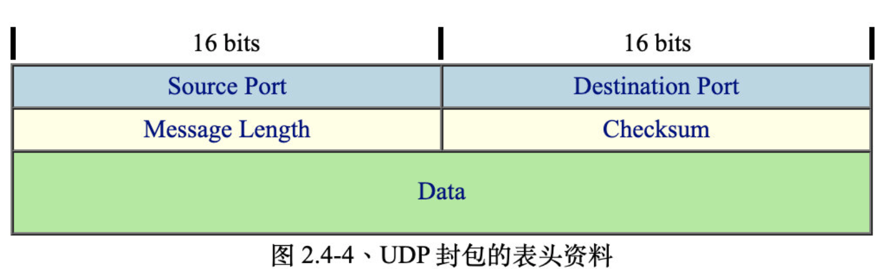
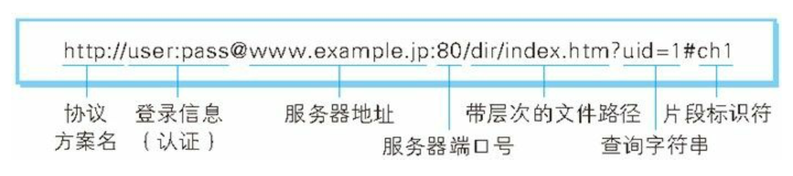
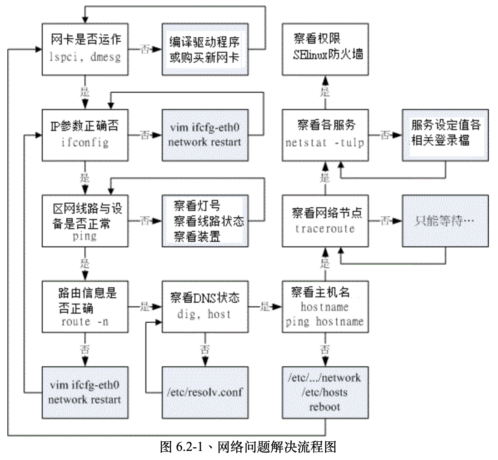

<!--ts-->
   * [鸟哥linux私房菜](#鸟哥linux私房菜)
      * [网络概念](#网络概念)
         * [链接层](#链接层)
         * [网络层](#网络层)
         * [传输层](#传输层)
         * [应用层](#应用层)
         * [总结](#总结)
      * [如何链接Linux](#如何链接linux)
      * [常用网络命令](#常用网络命令)
      * [网络帧错](#网络帧错)
      * [DNS服务器](#dns服务器)
      * [www服务器](#www服务器)

<!-- Added by: anapodoton, at: Sun Mar  1 22:02:59 CST 2020 -->

<!--te-->

# 鸟哥linux私房菜

## 网络概念

我们学习计算机网络，肯定是要看7层网络体系的。分别是应用层，表示层，会话层，传输层，网络层，数据链路层和物理层。但是分得这么详细，工程上实现起来是很麻烦的，我们为了方便实现，进行了简化。如下所示：


下面我们开始研究：

### 链接层

先来看链接层，我们主要研究广域网和局域网。先来看WAN，主要由传统电话拨接，整合服务数字网络 (Integrated Services Digital Network, ISDN)，非对称数位用路回路 (Asymmetric Digital Subscriber Line, ADSL)和电缆调制解调器 (Cable modem)。

接着来看局域网，局域网有多种实现方案，其中比较出名的是以太网，当然也有光纤。以太网的传输协议是CSMA/CD (Carrier Sense Multiple Access with Collision Detection) 。流程需要了解。

我们来看下MAC (Media Access Control) ，是网卡的编号，看一下其封装的格式：


里面还有一个细节：MTU (Maximum Transmission Unit, 最大传输单位)。虽然修改这个值可以减少拆包的概率，但是不是所有的网络都支持，所以不建议修改。

上面我们看到了，集线器有很多的缺点，碰撞的可能性太大了，我们需要去解决这个问题。先来看下，为什么会碰撞呢？是因为共享的。那么我们不共享就好了吧？引入了交换器的概念。


我们来看下交换器，交换器的特殊之处在于其内有一个特别的内存， 这个内存可以记录每个 switch port 与其连接的 PC 的 MAC 地址。所以可以直接进行通信。

总结下，网络硬件接口为以太网络，包括网络线、网络卡、Hub/Switch 等等。以太网络上面的传输使用网络卡卡号为基准的 MAC 讯框，配合 CSMA/CD 的标准来传送讯框，这就是硬件部分。

链接层的内容先到这里，下面我们接着看网络层IP。这个玩意是十分核心的，需要仔细来看。

### 网络层

先来看基础知识，首先要看的自然是IP的结构。IP分为IPv4和IPv6，我们主要关注前者。IP 封包可以达到 65535 bytes 这么大，在比 MAC 大的情况下，我们的操作系统会对 IP 进行拆解的动作


我们从图中看到，每一行所占用的位数为 32 bits。详细解释如下：

- Version(版本)：宣告这个 IP 封包的版本，例如目前惯用的还是 IPv4 这个版本就在这里宣告。
- IHL(Internet Header Length, IP表头的长度)：告知这个 IP 封包的表头长度，使用的单位应该是字组 (word) ，一个字组为 4bytes 大小喔。
- Type of Service(服务类型)：这个项目的内容为『PPPDTRUU』，表示这个 IP 封包的服务类型，主要分为：
  - PPP：表示此 IP 封包的优先度，目前很少使用；
  - D：若为 0 表示一般延迟(delay)，若为 1 表示为低延迟；
  - T：若为 0 表示为一般传输量 (throughput)，若为 1 表示为高传输量；
  - R：若为 0 表示为一般可靠度(reliability)，若为 1 表示高可靠度。
  - UU：保留尚未被使用。
- Total Length(总长度)：指这个 IP 封包的总容量，包括表头与内容 (Data) 部分。最大可达 65535 bytes。
- Identification(辨别码)：我们前面提到 IP 袋子必须要放在 MAC 袋子当中。不过，如果 IP 袋子太大的话，就得先要将 IP 再重组成较小的袋子然后再放到 MAC 当中。而当 IP 被重组时，每个来自同一个 IP 的小袋子就得要有个标识符以告知接收端这些小袋子其实是来自同一个 IP 封包才行。 也就是说，假如 IP 封包其实是 65536 那么大 (前一个 Total Length 有规定)， 那么这个 IP 就得要再被分成更小的 IP 分段后才能塞进 MAC 讯框中。那么每个小 IP 分段是否来自同一个 IP 资料，呵呵！那就是这个标识符的功用啦！
- Flags(特殊旗标)这个地方的内容为『0DM』，其意义为：
  - D：若为 0 表示可以分段，若为 1 表示不可分段
  - M：若为 0 表示此 IP 为最后分段，若为 1 表示非最后分段。
- Fragment Offset(分段偏移)：表示目前这个 IP 分段在原始的 IP 封包中所占的位置。就有点像是序号啦，有这个序号才能将所有的小 IP 分段组合成为原本的 IP 封包大小嘛！透过 Total Length, Identification, Flags 以及这个 Fragment Offset 就能够将小 IP 分段在收受端组合起来啰！
- **Time To Live(TTL, 存活时间)**：表示这个 IP 封包的存活时间，范围为 0-255。当这个 IP 封包通过一个路由器时， TTL 就会减一，当 TTL 为 0 时，这个封包将会被直接丢弃。说实在的，要让 IP 封包通过 255 个路由器，还挺难的。
- **Protocol Number(协定代码)**：来自传输层与网络层本身的其他数据都是放置在 IP 封包当中的，我们可以在 IP 表头记载这个 IP 封包内的资料是啥， 在这个字段就是记载每种数据封包的内容啦！在这个字段记载的代码与相关的封包协议名称如下所示：
- Header Checksum(表头检查码)：用来检查这个 IP 表头的错误检验之用。
- **Source Address**：还用讲吗？当然是来源的 IP 地址，从这里我们也知道 IP 是 32 位喔！
- **Destination Address**：有来源还需要有目标才能传送，这里就是目标的 IP 地址。
- Options (其他参数)：这个是额外的功能，提供包括安全处理机制、路由纪录、时间戳、严格与宽松之来源路由等。
- Padding(补齐项目)：由于 Options 的内容不一定有多大，但是我们知道 IP 每个数据都必须要是 32 bits，所以，若 Options 的数据不足 32 bits 时，则由 padding 主动补齐。

我们主要关注TTL, Protocol, 来源地址与目标地址。

上面我们主要看了IP的结构，并且知道了32的IP地址是很重要的，这32的IP地址怎么使用，是个大学问。二进制数据实在是太难记了，我们8位为一组，分为4段。大概是这样0.0.0.0 一直到 255.255.255.255。当然，在实际应用中，不是这么分配的，就像我们每个人的姓名由姓和名组成，IP地址也是，由Net_ID (网域号码)与 Host_ID (主机号码)组成。为了方便管理，我们把IP进行了分级：


我们只需要关注ABC三级即可。

事情到这里并没有结束，由于IP数量的不足，我们把IP分为共有IP和私有IP。私有的IP的网段分为：

- Class A：10.0.0.0  - 10.255.255.255
- Class B：172.16.0.0 - 172.31.255.255
- Class C：192.168.0.0 - 192.168.255.255

private IP的好处是可以保护内部的电脑，也可以增加上网的主机的数量。需要借助于NAT（Network Address Translation，网络地址转换）技术，主要包括静态地址转换和动态地址转换。

可以通过DHCP来向管理员获取IP地址。

我们前面管理IP地址，只是分为了网络地址+主机地址来管理，事实上，在企业内部进行管理IP地址的时候，也可以进行更加仔细的管理，比如一个公司有2个部门，想要分开来管理，就可以向主机地址借一位来作为网络地址。

于是我们就引入了子网掩码的概念了（**Netmask**）。我们来详细的看：


注意，子网掩码的概念是网络位全为1，主机位全为0。除此之外，还有2个保留地址，第一个是该网段的IP，最后一个是广播地址。


同时我们规定，A类地址的子网掩码是255.0.0.0,B类是255.255.0.0，C类地址的子网掩码是255.255.255.0。需要牢记。

下面我们来看**无层级 IP： CIDR (Classless Interdomain Routing)**：

比如说C类某个IP的CIDR表示就是192.168.0.0/24 

下面我们来看路由的概念，不同网络断之间的主机要如何进行通信呢？

每台主机都会有自己的路由表，大概流程是这样的：

- 查询 IP 封包的目标 IP 地址；
- 查询是否位于本机所在的网域之路由设定：
- 查询预设路由 (default gateway)；
- 送出封包至 gateway 后，不理会封包流向。

我们可以借助于route来查看本机的路由表：

```shell
[root@www ~]# route -n
Kernel IP routing table
Destination     Gateway         Genmask         Flags Metric Ref  Use Iface
192.168.0.0     0.0.0.0         255.255.255.0   U     0      0      0 eth0
127.0.0.0       0.0.0.0         255.0.0.0       U     0      0      0 lo
0.0.0.0         192.168.0.254   0.0.0.0         UG    0      0      0 eth0

# 上面输出的数据共有八个字段，你需要注意的有几个地方：
# Destination ：其实就是 Network 的意思，目的地的网域。
# Gateway     ：就是该接口的 Gateway 那个 IP (一般指路由器)啦！若为 0.0.0.0 表示不需要额外的 IP；
# Genmask     ：就是 Netmask 啦！与 Destination 组合成为一部主机或网域；
# Flags       ：共有多个旗标可以来表示该网域或主机代表的意义：
#               U：代表该路由可用；
#               G：代表该网域需要经由 Gateway 来帮忙转递；
#               H：代表该行路由为一部主机，而非一整个网域；
# Iface       ：就是 Interface (接口) 的意思，网络接口
```

总结一下，我们学习了IP与MAC，我们肯定是需要绑定的，那么问题来了，我们怎么进行绑定呢，引入了**链结层的 ARP 与 RARP 协定**。 ARP (Address Resolution Protocol, 网络地址解析) 协议以及 RARP (Revers ARP, 反向网络地址解析)，作用是在IP地址和MAC之间建立映射。

我们想要通信时，会发起ARP请求，接收方会把MAC地址传回，然后就可以通信了，为了进行优化，我们引入了ARP表来进行缓存。

我们可以使用ifconfig eth0来获取本机的mac地址。


可以使用arp -n来获取arp表格（20分钟更新一次）


到现在这里还有一个问题，我们需要保证网络连接的正确性，引入了ICMP ，全名是『 Internet Control Message Protocol, 因特网讯息控制协议 』。ICMP 是一个错误侦测与回报的机制，最大的功能就是可以确保我们网络的联机状态与联机的正确性。封装在IP层。

网络层的介绍到此为止，我们下面来学习传输层。主要学习TCP/UDP。这两个是贼重要的。

### 传输层

先来看TCP。


TCP长成这样：



先来详细分析下：

- **Source Port & Destination Port (来源端口 & 目标端口)**
  我们需要端口来干什么呢？我们知道，本质上来讲，IP层封装了计算机，通过网络层，我们可以保证消息可以穿到相应的计算机主机上，那么我们计算机上有很多的应用，到底给谁呢？这个就是端口的作用了。

  port存放在/etc/services 中，netstat监听自己的端口，nmap可以监听别的主机。常用的指令是netstat -tunl。

- **Sequence Number (序列号)**
  **用来解决网络包乱序（reordering）问题**。由于 TCP 封包必须要带入 IP 封包当中，所以如果 TCP 数据太大时(大于 IP 封包的容许程度)， 就得要进行分段。这个 Sequence Number 就是记录每个封包的序号，可以让收受端重新将 TCP 的数据组合起来。

- **Acknowledge Number (应答号)**
  **用来解决不丢包的问题**。为了确认主机端确实有收到我们 client 端所送出的封包数据，我们 client 端当然希望能够收到主机方面的响应，那就是这个 Acknowledge Number 的用途了。 当 client 端收到这个确认码时，就能够确定之前传递的封包已经被正确的收下了。

- Data Offset (数据偏移)
  在图 2.4-2 倒数第二行有个 Options 字段对吧！那个 Options 的字段长度是非固定的，而为了要确认整个 TCP 封包的大小，就需要这个标志来说明整个封包区段的起始位置。

- Reserved (保留)
  未使用的保留字段。

- Code (Control Flag, 控制标志码)

  当我们在进行网络联机的时候，必须要说明这个联机的状态，好让接收端了解这个封包的主要动作。 这可是一个非常重要的句柄喔！这个字段共有 6 个 bits ，分别代表 6 个句柄，若为 1 则为启动。分别说明如下：

  - URG(Urgent)：若为 1 则代表该封包为紧急封包， 接收端应该要紧急处理，且图 2.4-1 当中的 Urgent Pointer 字段也会被启用。
  - ACK(Acknowledge)：若为 1 代表这个封包为响应封包， 则与上面提到的 Acknowledge Number 有关。
  - PSH(Push function)：若为 1 时，代表要求对方立即传送缓冲区内的其他对应封包，而无须等待缓冲区满了才送。
  - RST(Reset)：如果 RST 为 1 的时候，表示联机会被马上结束，而无需等待终止确认手续。这也就是说， 这是个强制结束的联机，且发送端已断线。
  - SYN(Synchronous)：若为 1，表示发送端希望双方建立同步处理， 也就是要求建立联机。通常带有 SYN 标志的封包表示『主动』要连接到对方的意思。
  - FIN(Finish)：若为 1 ，表示传送结束，所以通知对方数据传毕， 是否同意断线，只是发送者还在等待对方的响应而已。

  其实每个项目都很重要，不过我们这里仅对 ACK/SYN 有兴趣而已，这样未来在谈到防火墙的时候，你才会比较清楚为啥每个 TCP 封包都有所谓的『状态』条件！那就是因为联机方向的不同所致啊！底下我们会进一步讨论喔！ 至于其他的数据，就得请您自行查询网络相关书籍了！

- Window (滑动窗口)
  主要是用来控制封包的流量的，可以告知对方目前本身有的缓冲器容量(Receive Buffer) 还可以接收封包。当 Window=0 时，代表缓冲器已经额满，所以应该要暂停传输数据。 Window 的单位是 byte。

- Checksum(确认检查码)
  当数据要由发送端送出前，会进行一个检验的动作，并将该动作的检验值标注在这个字段上； 而接收者收到这个封包之后，会再次的对封包进行验证，并且比对原发送的 Checksum 值是否相符，如果相符就接受，若不符就会假设该封包已经损毁，进而要求对方重新发送此封包！

- Urgent Pointer(紧急资料)
  这个字段是在 Code 字段内的 URG = 1 时才会产生作用。可以告知紧急数据所在的位置。

- Options(任意资料)
  目前此字段仅应用于表示接收端可以接收的最大数据区段容量，若此字段不使用， 表示可以使用任意资料区段的大小。这个字段较少使用。

- Padding(补足字段)
  如同 IP 封包需要有固定的 32bits 表头一样， Options 由于字段为非固定， 所以也需要 Padding 字段来加以补齐才行。同样也是 32 bits 的整数。

大概看了下TCP包的内容，下面我们来看下其中比较重要的地方：

端口是很重要的，我们在写程序的时候，不要占用常用程序的端口。接下来重要的是三次握手和四次挥手，用于建立连接和断开连接。详细过程比较重要。

看完TCP，我们来看UDP，User Datagram Protocol,长成这样：



我们需要区分TCP和UDP，这个玩意，在面试中是很常见的。

### 应用层

最后我们来看应用层，为了上网，我们可以使用IP地址，但是基本没有人可以记住，所以我们引入了网址的概念，配个DNS（Domain Name System），我们实现了网址和IP地址的转换。

我们来看下，如果我们的计算机需要联网，我们需要什么？IP，Netmask，Network,Broadcast，Gateway和DNS。

参考《图解http》

最后我们来看应用层http（HyperText Transfer Protocol ）。早在1989年，我们http就诞生了，CERN(欧洲核子研究组织 ）设计了最初的理念：借助多文档之间相互关联形成的超文本 (HyperText)，连成可相互参阅的 WWW(World Wide Web，万维 网)。 并且提出了3项www构建技术，把 SGML(Standard Generalized Markup Language，标准通用标记语言)作为页面的文本标 记语言的 HTML(HyperText Markup Language，超文本标记语言); 作为文档传递协议的 HTTP ;指定文档所在地址的 URL(Uniform Resource Locator，统一资源定位符)。

http协议主要由以下几个，可以参考https://coolshell.cn/articles/19840.html，很好的发展史。

概括下，http/0.9  1990问世，并不完善，然后出了http/1.0，添加了版本号，header，状态码，Content-Type等。但是缺点是网络性能，于是http/1.1修复了这个问题，还加入了新的功能。后面还有http/2,http/3。

我们需要在这里区分下**URI和URL**。

URI 是 Uniform Resource Identifier 的缩写，Request For Comments（*RFC2396*）进行了定义。URI的一个例子

```
ftp://ftp.is.co.za/rfc/rfc1808.txt 
http://www.ietf.org/rfc/rfc2396.txt 
ldap://[2001:db8::7]/c=GB?objectClass?one 
mailto:John.Doe@example.com 
news:comp.infosystems.www.servers.unix 
tel:+1-816-555-1212
telnet://192.0.2.16:80/ 
urn:oasis:names:specification:docbook:dtd:xml:4.1.2
```

URI 用字符串标识某一互联网资源，而 URL 表示资源的地点(互联 网上所处的位置)。可见 URL 是 URI 的子集。 



我们需要理解以下核心概念；

> http协议：Cookie： domain, path, expiration 
>
> HTTP状态码 
>
> HTTP长连接 ，由此扩展到websocket。 
>
> HTTP重定向 ，非常有用的技术，对理解OAuth, CAS（SSO）很有帮助。 
>
> 缓存 ：Last-Modified和ETag 
>
> chunked ：分块传输 

一个一个的来看：


我们知道http使用了TCP，每次建立连接需要经过三次握手，很少消耗资源，为了优化，引入了HTTP Persistent Connections，也称作HTTP keep-alive。

我们知道http是无状态的，请求和响应都没有序列化，所以我们引入了cookie技术。Cookie 技术通过在请求和响应报文中写入 Cookie 信 息来控制客户端的状态。 

下面我们看下http的报文：


为了进行优化，我们可以进行压缩，常用的压缩有gzip,**compress**等。此外，在发送大文件的时候，我们可以把数据分块发送，分块传输编码(Chunked Transfer Coding) 。

随着网络的发展，我们可能需要发送越来越多类型的对象，图片，视频都是可能的，是因为引入了MIME(Multipurpose Internet Mail Extensions).

此外，http的状态码也是十分重要的，先浏览下：


我们看几个常见的，先来看2XX 的响应结果表明请求被正常处理了，200代表成功，204代表处理成功，但是没有可返回的资源，**206 Partial Content** 表示返回部分数据。

下面看3**重定向类的，**表明浏览器需要执行某些特殊的处理以正确处理请求。301 Moved Permanently，302临时性重定向，注意和301对比，303**See Other**，注意区分，还有**304 Not Modified** ，**307 Temporary Redirect**。

继续看4客户端错误的，**400 Bad Request** ，表示请求报文中存在语法错误 ；**401 Unauthorized** ；**403 Forbidden** ；**404 Not Found** 。

最后来看5服务器错误。**500 Internal Server Error** ；**503 Service Unavailable** 。

这个话题到此结束，我们来看下一个话题，想想这么一个场景，我们可能有一个需求，在一台服务器上部署多个应用，比如a.com,b.com。用户访问后，经过DNS解析后，请求到了同一台服务器，怎么区分呢？

这个时候是不能用端口来区分的，原因在于都是www服务，使用的是同一个端口，那么怎么办呢？答案是必须在 Host 首部内完整指定主机名或域名的 URI。  

http的报文首部是十分重要的，我们来看下：


详细的看下面：


具体来看，几个比较重要的，**Cache-Control** ，Cache-Control: private, max-age=0, no-cache 


Connection也是比较重要的，主要有两个作用，控制不再转发给代理的首部字段 ，管理持久连接。

**Date**是时间。

**ransfer-Encoding** 指定了编码格式。

**Accept** 指定接收文件的格式；

**Referer** 告知服务器请求的原始资源的 URI。

**User-Agent** 用于传达浏览器的种类。

还有很多的，需要不断的学习。


**HTTP+** 加密 **+** 认证 **+** 完整性保护 **=HTTPS** 

当然静态的html不能满足我们的需求，我们希望服务器可以返回动态的内容。第一个解决方案是CGI，CGI(Common Gateway Interface，通用网关接口)是指 Web 服务器在 接收到客户端发送过来的请求后转发给程序的一组机制。 比如php等语言。标准是RFC3875。

当然，CGI没有一家独大，Java推出了Servlet（Server+Applet ）。


我们可以看到CGI，由于每次接到请求，程序都要跟着启动一次。因此 一旦访问量过大，Web 服务器要承担相当大的负载。而 Servlet 运行 在与 Web 服务器相同的进程中，因此受到的负载较小。

总结下，比较常用的概念：Router（路由器），FireWall（防火墙），NAT,DHCP,DNS,Proxy。

### 总结

- 虽然目前的网络媒体多以以太网络为标准，但网络媒体不只有以太网络而已；
- Internet 主要是由 Internet Network Information Center (INTERNIC) 所维护；
- 以太网络的 RJ-45 网络线，由于 568A/568B 接头的不同而又分为并行线与跳线；
- 以太网络上最重要的传输数据为 Carrier Sense Multiple Access with Collision Detect (CSMA/CD) 技术， 至于传输过程当中，最重要的 MAC 讯框内以硬件地址 (hardware address) 数据最为重要；
- 透过八蕊的网络线 (Cat 5 以上等级)，现在的以太网络可以支持全双工模式；
- OSI 七层协议为一个网络模型 (model) ，并非硬性规定。这七层协议可以协助软硬件开发有一个基本的准则， 且每一分层各自独立，方便使用者开发；
- 现今的网络基础是架构在 TCP/IP 这个通讯协议上面；
- 数据链结层里重要的信息为 MAC (Media Access Control)，亦可称为硬件地址，而 ARP Table 可以用来对应 MAC 与软件地址 ( IP ) ；
- 在网络媒体方面， Hub 为共享媒体，因此可能会有封包碰撞的问题，至于 Switch 由于加入了 switch port 与 MAC 的对应，因此已经克服了封包碰撞的问题，也就是说，Switch 并不是共享媒体；
- IP 为 32 bits 所组成的，为了适应人类的记忆，因此转成四组十进制的数据；
- IP 主要分为 Net ID 与 Host ID 两部份，加上 Netmask 这个参数后，可以设定『网域』的概念；
- 根据 IP 网域的大小，可将 IP 的等级分为 A, B, C 三种常见的等级；
- Loopback 这个网段在 127.0.0.0/8 ，用在每个操作系统内部的循环测试中。
- 网域可继续分成更小的网域 (subnetwork)，主要是透过将 Host_ID 借位成为 Net_ID 的技术；
- IP 只有两种，就是 Public IP 与 Private IP ，中文应该翻译为 公共 IP 与 私有(或保留) IP，私有 IP 与私有路由不可以直接连接到 Internet 上；
- 每一部主机都有自己的路由表，这个路由表规定了封包的传送途径，在路由表当中，最重要者为默认的通讯闸 ( Gateway/Router )；
- TCP 协议的表头数据当中，那个 Code (control flags) 所带有的 ACK, SYN, FIN 等为常见的旗标， 可以控制封包的联机成功与否；
- TCP 与 IP 的 IP address/Port 可以组成一对 socket pair
- 网络联机都是双向的，在 TCP 的联机当中，需要进行客户端与服务器端两次的 SYN/ACK 封包发送与确认， 所以一次 TCP 联机确认时，需要进行三向交握的流程；
- UDP 通讯协议由于不需要联机确认，因此适用于快速实时传输且不需要数据可靠的软件中，例如实时通讯；
- ICMP 封包最主要的功能在回报网络的侦测状况，故不要使用防火墙将他完全挡掉；
- 一般来说，一部主机里面的网络参数应该具备有：IP, Netmask, Network, Broadcast, Gateway, DNS 等；
- 在主机的 port 当中，只有 root 可以启用小于 1024 以下的 port ；
- DNS 主要的目的在于进行 Hostname 对应 IP 的功能；

## 如何链接Linux

先来看一些基础知识，默认的网卡是eth0,eth1...

我们可以使用dmesg | grep -in eth来查看网卡，再来看下网络相关文件：


## 常用网络命令

我们先来看下网络参数设定使用的指令：

先来看**ifconfig**：查询、设定网络卡与 IP 网域等相关参数。

```shell
[root@www ~]# ifconfig {interface} {up|down}  <== 观察与启动接口
[root@www ~]# ifconfig interface {options}    <== 设定与修改接口
选项与参数：
interface：网络卡接口代号，包括 eth0, eth1, ppp0 等等
options  ：可以接的参数，包括如下：
    up, down ：启动 (up) 或关闭 (down) 该网络接口(不涉及任何参数)
    mtu      ：可以设定不同的 MTU 数值，例如 mtu 1500 (单位为 byte)
    netmask  ：就是子屏蔽网络；
    broadcast：就是广播地址啊！

# 范例一：观察所有的网络接口(直接输入 ifconfig)
[root@www ~]# ifconfig
eth0      Link encap:Ethernet  HWaddr 08:00:27:71:85:BD
          inet addr:192.168.1.100  Bcast:192.168.1.255  Mask:255.255.255.0
          inet6 addr: fe80::a00:27ff:fe71:85bd/64 Scope:Link
          UP BROADCAST RUNNING MULTICAST  MTU:1500  Metric:1
          RX packets:2555 errors:0 dropped:0 overruns:0 frame:0
          TX packets:70 errors:0 dropped:0 overruns:0 carrier:0
          collisions:0 txqueuelen:1000
          RX bytes:239892 (234.2 KiB)  TX bytes:11153 (10.8 KiB)
```

- **eth0**：就是网络卡的代号，也有 lo 这个 loopback ；
- **HWaddr**：就是网络卡的硬件地址，俗称的 MAC 是也；
- **inet addr**：IPv4 的 IP 地址，后续的 Bcast, Mask 分别代表的是 Broadcast 与 netmask 喔！
- **inet6 addr**：是 IPv6 的版本的 IP ，我们没有使用，所以略过；
- **MTU**：就是第二章谈到的 [MTU](http://linux.vbird.org/linux_server/0110network_basic.php#tcpip_link_mtu) 啊！
- **RX**：那一行代表的是网络由启动到目前为止的封包接收情况， packets 代表封包数、errors 代表封包发生错误的数量、 dropped 代表封包由于有问题而遭丢弃的数量等等
- **TX**：与 RX 相反，为网络由启动到目前为止的传送情况；
- **collisions**：代表封包碰撞的情况，如果发生太多次， 表示你的网络状况不太好；
- **txqueuelen**：代表用来传输数据的缓冲区的储存长度；
- **RX bytes, TX bytes**：总接收、发送字节总量

还有2个比较重要的是**ifup, ifdown**。

下面来看route：

```shell
[root@www ~]# route [-nee]
[root@www ~]# route add [-net|-host] [网域或主机] netmask [mask] [gw|dev]
[root@www ~]# route del [-net|-host] [网域或主机] netmask [mask] [gw|dev]
观察的参数：
   -n  ：不要使用通讯协议或主机名，直接使用 IP 或 port number；
   -ee ：使用更详细的信息来显示
增加 (add) 与删除 (del) 路由的相关参数：
   -net    ：表示后面接的路由为一个网域；
   -host   ：表示后面接的为连接到单部主机的路由；
   netmask ：与网域有关，可以设定 netmask 决定网域的大小；
   gw      ：gateway 的简写，后续接的是 IP 的数值喔，与 dev 不同；
   dev     ：如果只是要指定由那一块网络卡联机出去，则使用这个设定，后面接 eth0 等

# 范例一：单纯的观察路由状态
[root@www ~]# route -n
Kernel IP routing table
Destination     Gateway         Genmask         Flags Metric Ref    Use Iface
192.168.1.0     0.0.0.0         255.255.255.0   U     0      0        0 eth0
169.254.0.0     0.0.0.0         255.255.0.0     U     1002   0        0 eth0
0.0.0.0         192.168.1.254   0.0.0.0         UG    0      0        0 eth0

[root@www ~]# route
Kernel IP routing table
Destination     Gateway         Genmask         Flags Metric Ref    Use Iface
192.168.1.0     *               255.255.255.0   U     0      0        0 eth0
link-local      *               255.255.0.0     U     1002   0        0 eth0
default         192.168.1.254   0.0.0.0         UG    0      0        0 eth0
```

**网络参数综合指令： ip**

整合了整合了 ifconfig 与 route 两个指令。

**无线网络： iwlist, iwconfig**

- iwlist：利用无线网卡进行无线 AP 的侦测与取得相关的数据；
- iwconfig：设定无线网卡的相关参数。

下面我们来看网络侦错指令：

首先来看ping，可以用来查看两部主机两点是否沟通？

然后来看**traceroute**，可以用来分析2台主机之间是否连通？


**netstat**用来察看本机的网络联机与后门：

用来查看网络服务对应的端口是否真的启动了。

- **Proto**：该联机的封包协议，主要为 TCP/UDP 等封包；

- **Recv-Q**：非由用户程序连接所复制而来的总 bytes 数；

- **Send-Q**：由远程主机所传送而来，但不具有 ACK 标志的总 bytes 数， 意指主动联机 SYN 或其他标志的封包所占的 bytes 数；

- **Local Address**：本地端的地址，可以是 IP (-n 参数存在时)， 也可以是完整的主机名。使用的格是就是『 IP:port 』只是 IP 的格式有 IPv4 及 IPv6 的差异。 如上所示，在 port 22 的接口中，使用的 :::22 就是针对 IPv6 的显示，事实上他就相同于 0.0.0.0:22 的意思。 至于 port 25 仅针对 lo 接口开放，意指 Internet 基本上是无法连接到我本机的 25 埠口啦！

- **Foreign Address**：远程的主机 IP 与 port number

- stat

  ：状态栏，主要的状态含有：

  - ESTABLISED：已建立联机的状态；
  - SYN_SENT：发出主动联机 (SYN 标志) 的联机封包；
  - SYN_RECV：接收到一个要求联机的主动联机封包；
  - FIN_WAIT1：该插槽服务(socket)已中断，该联机正在断线当中；
  - FIN_WAIT2：该联机已挂断，但正在等待对方主机响应断线确认的封包；
  - TIME_WAIT：该联机已挂断，但 socket 还在网络上等待结束；
  - LISTEN：通常用在服务的监听 port ！可使用『 -l 』参数查阅。

下面来看host和nslookup

host www.baidu.com

nslookup www.baidu.com

下面我们来看telnet，注意和ping进行区分。

最后总结下：

- 修改网络接口的硬件相关参数，可以使用 ifconfig 这个指令，包括 MTU 等等；
- ifup 与 ifdown 其实只是 script ，在使用时，会主动去 /etc/sysconfig/network-scripts 下找到相对应的装置配置文件，才能够正确的启动与关闭；
- 路由的修改与查阅可以使用 route 来查询，此外， route 亦可进行新增、删除路由的工作；
- ip 指令可以用来作为整个网络环境的设定，利用 ip link 可以修改『网络装置的硬件相关功能』， 包括 MTU 与 MAC 等等，可以使用 ip address 修改 TCP/IP 方面的参数，包括 IP 以及网域参数等等， ip route 则可以修改路由！
- ping 主要是透过 ICMP 封包来进行网络环境的检测工作，并且可以使用 ping 来查询整体网域可接受最大的 MTU 值；
- 侦察每个节点的联机状况，可以使用 traceroute 这个指令来追踪！
- netstat 除了可以观察本机的启动接口外，还可以观察 Unix socket 的传统插槽接口数据；
- host 与 nslookup 预设都是透过 /etc/resolv.conf 内设定的 DNS 主机来进行主机名与 IP 的查询；
- lftp 可以用来匿名登录远程的 FTP 主机；
- links 主要的功能是『浏览』，包括本机上 HTML 语法的档案， wget 则主要在用来下载 WWW 的资料；
- 撷取封包以分析封包的流向，可使用 tcpdump ，至于图形接口的 wireshark 则可以进行更为详细的解析。
- 透过 tcpdump 分析三向交握，以及分析明码传输的数据，可发现网络加密的重要性。
- nc 可用来取代 telnet 进行某些服务埠口的检测工作。

 ## 网络帧错

1. 网卡可以正常工作

   1. **确定可以手动直接建立 IP 参数**

      ```
      ifconfig eth0 192.168.1.100
      ping 192.168.1.10
      ```

2. **局域网络内各项连接设备检测**

   1. 检查**IP 参数是否设定正确**，先决定 IP/netmask
   2. **Hub/Switch** 

3. **取得正确的 IP 参数**

4. 确认路由表的规则

5. **主机名与 IP 查询的 DNS 错误**

6. **Linux 的 NAT 服务器或 IP 分享器出问题**

总结，网络问题解决流程图：



下面我们来看DHCP(Dynamic Host Configuration Protocol) 。 IP, netmask, network, broadcast 与 gateway 都可以在 /etc/sysconfig/network-scripts/ifcfg-eth[0-n] 这档案里面设定，DNS 服务器的地址则是在 /etc/resolv.conf 里头设定。然后利用NAT功能就可以上网了。


1. **客户端：利用广播封包发送搜索 DHCP 服务器的封包：**
2. **服务器端：提供客户端网络相关的租约以供选择：**
   1. 到服务器的登录文件中寻找该用户之前是否曾经用过某个 IP ，若有且该 IP 目前无人使用，则提供此 IP 给客户端；
   2. 若配置文件针对该 MAC 提供额外的固定 IP (static IP) 时，则提供该固定 IP 给客户端；
   3. 若不符合上述两个条件，则随机取用目前没有被使用的 IP 参数给客户端，并记录下来。
3. **客户端：决定选择的 DHCP 服务器提供的网络参数租约并回报服务器：**
4. **服务器端：记录该次租约行为并回报客户端已确认的响应封包信息：**


DHCP 服务器给予客户端的 IP 参数为固定或动态：

```
# 1. 观察自己的 MAC 可用 ifconfig：
[root@www ~]# ifconfig | grep HW
eth0      Link encap:Ethernet  HWaddr 08:00:27:71:85:BD
eth1      Link encap:Ethernet  HWaddr 08:00:27:2A:30:14
# 因为鸟哥有两张网卡，所以有两个硬件地址喔！

# 2. 观察别人的 MAC 可用 ping 配合 arp
[root@www ~]# ping -c 3 192.168.1.254
[root@www ~]# arp -n
Address        HWtype  HWaddress           Flags Mask   Iface
192.168.1.254  ether   00:0c:6e:85:d5:69   C            eth0
```

- DHCP (Dynamic Host Configuration Protocol) 可以提供网络参数给客户端计算机，使其自动设定网络的功能；
- 透过 DHCP 的统一管理，在同一网域当中就比较不容易出现 IP 冲突的情况发生；
- DHCP 可以透过 MAC 的比对来提供 Static IP (或称为固定 IP)，否则通常提供客户端 dynamic IP (或称为动态 IP)；
- DHCP 除了 Static IP 与 Dynamic IP 之外，还可以提供租约行为之设定；
- 在租约期限到期之前，客户端 dhcp 软件即会主动的要求更新 (约 0.5, 0.85 倍租约时间左右)；
- DHCP 可以提供的 MAC 比对、Dynamic IP 的 IP 范围以及租约期限等等，都在 dhcpd.conf 这个档案当中设定的；
- 一般的情况之下，使用者需要自行设定 dhcpd.leases 这个档案，不过，真正的租约档案记录是在 /var/lib/dhclient/dhclient-eth0.leases 里面；
- 如果只是要单纯的 DHCP 服务，建议可以购买类似 IP 分享器的设备即可提供稳定且低耗电的网络服务。
- DHCP 服务与 DNS 服务的相关性很高；
- 若 DHCP 客户端取得 IP 的速度太慢，或许可以找一下有网管 switch 的 STP 设定值。

## DNS服务器

- 在 Internet 当中，任何一部合法的主机都具有独一无二的主机名，这个主机名包含了 hostname 与 domain name ，并称为 Fully Qualified Domain Name (FQDN)；
- 为了克服人类对于 IP 不易记忆的困扰，而有名称解析器的产生，首先是 /etc/hosts ，而后则是 DNS 系统的产生；
- 目前 Unix Like 的机器当中，都是以 BIND 这个柏克莱大学发展的软件来架设 DNS 服务器；
- DNS 是个协议的名称，BIND 则是一个软件，这个软件提供的程序为 named ！
- 在 DNS 当中，每一笔记录我们就称他为 RR (Resource Record)。
- 在 DNS 系统中，正解为由 hostname 找 IP ，而反解则是由 IP 找 hostname ，至于 zone 则是一个或者是部分网域的设定值；
- 在 bind 9 之后，预设的情况下 named 已经作了 chroot 的动作。
- Slave 主机本身并没有自行设定 zone file ，其 zone file 是由 Master 主机传送而来，因此， master 主机必须要针对 slave 主机开放 allow-transfer 的设定项目才行。
- 整个 DNS 搜寻的流程当中，若找不到本身的数据，则会向 root(.) 要求资料；
- 正解的纪录(record)主要有：SOA, A, MX, NS, CNAME, TXT 及 HINFO 等；
- 反解的纪录主要有： SOA, PTR 等；
- DNS 查询的指令主要有： host, nslookup, dig, whois 等等；
- 在载入了 named 这个 daemon 之后，请务必前往 /var/log/messages 察看此 daemon 的成功与否。

## www服务器

WWW 是 World Wide Web的缩写，我们来看下www（主要由unix-like的apache）是怎么来的？最开始有人造了http，为了http的使用，NCSA推出了HTTPd (HTTP daemon),由于httpd存在问题，有人造了apache。这个目录存放在 /var/www/html/ 下。


